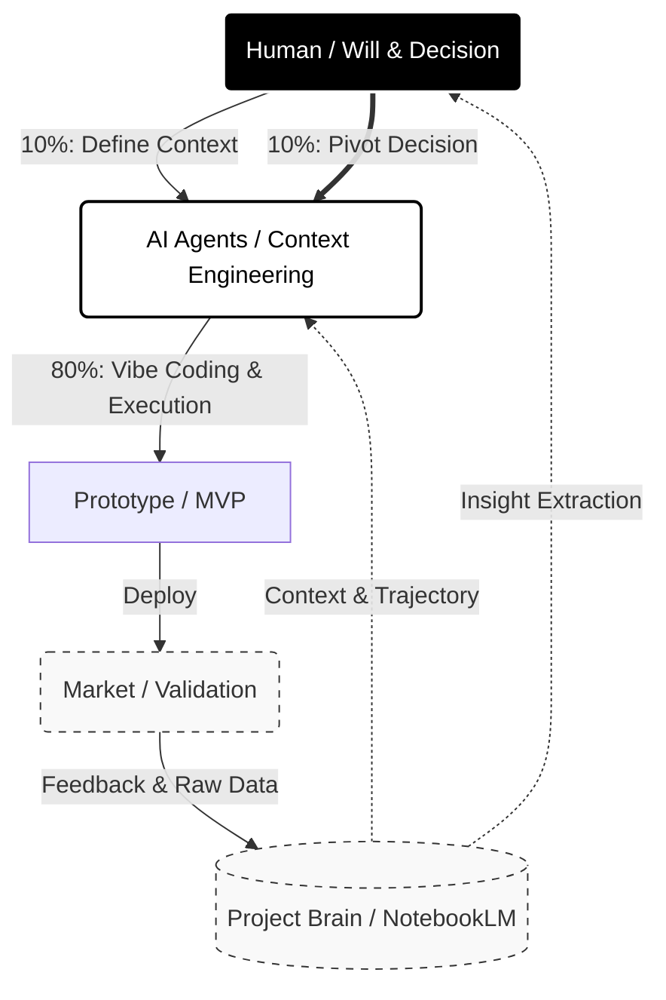

# depth-and-velocity
New Business Development in the GenAI Era
Redefining the "Operating System" of Innovation.

## 1. Introduction
We are rewriting the OS of business creation.
In the GenAI era, the goal is not just efficiency, but achieving **"Depth" (Insight)** and **"Velocity" (Speed)** simultaneously.

## 2. The Golden Rule: 10:80:10
The role of the professional shifts from "Doing" to "Orchestrating".

| Ratio | Owner | Role |
| :--- | :--- | :--- |
| **10%** | **Human** | **The Will (問いを立てる)** Defining the core question and intent. |
| **80%** | **AI** | **The Acceleration (具体化)** Execution, Coding, and Research at overwhelmed speed. |
| **10%** | **Human** | **The Decision (意思決定)** Critical thinking and final judgment. |

> **"Human-in-the-loop"** is the condition for professionals.

## 3. Architecture: The Project Brain
We do not just save "Results"; we archive the entire **"Trajectory (Process)"**—including hesitation, failures, and dialogue—into a database (NotebookLM) to build a **"Project Brain"**.

## 4. Democratization of Development
Business architects can now build functional prototypes instantly using AI Agents (Bolt, Claude Code, etc.).
We use **"Working Prototypes"** to hack the stakeholder's "Right Brain" and accelerate validation.

---

### [Leading AI Official Website](https://leading-ai.io)
_Methodology by Satoshi Yamauchi_

---

## Upcoming Event:
2/26 Webinar: Deep Dive into https://sun-asterisk.com/news/event/5425/
