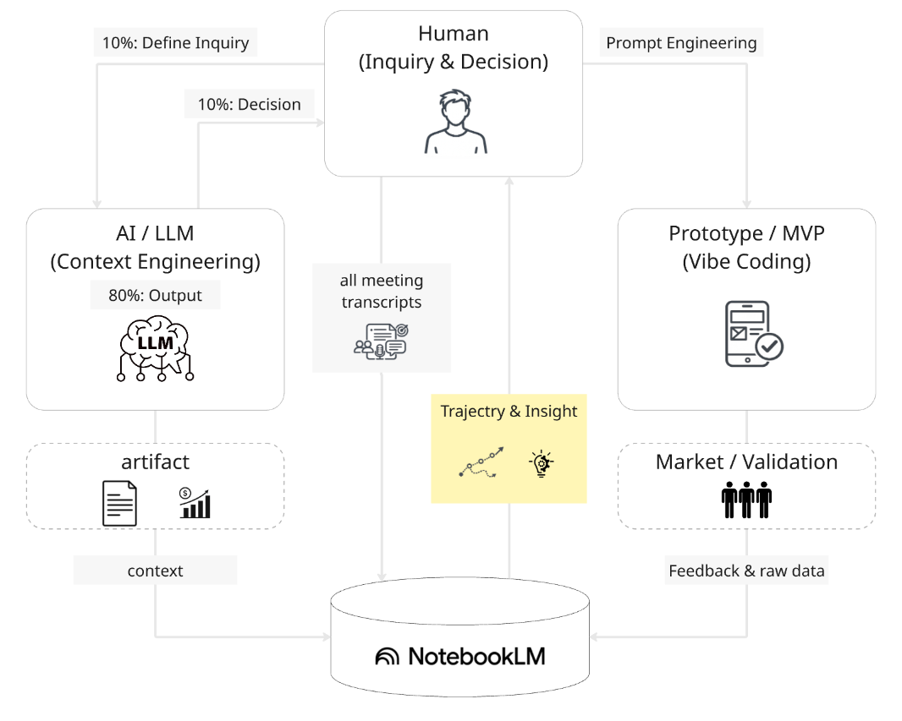

# Depth & Velocity: The Manifesto for Generative AI Business Development

> **"Logic implies, Emotion drives."**

## Introduction: Why the Old Way is Broken

"SaaS is Dead" is just the beginning.
In an era where AI agents write code, design interfaces, and execute marketing campaigns, humans are no longer the bottleneck for "Tasks." The real bottlenecks are **"Decision"** and **"Will."**

Traditional business development—spending months on market research, perfecting PowerPoint decks, and seeking approval before writing a single line of code—is not just "too slow." It is fundamentally **wrong**.

We need a new Operating System.
We call it **"Depth & Velocity."**

---

## 1. The Core Concept: The 10:80:10 Rule

The workflow of the AI era completely redefines the roles of humans and machines.
We call this **"The 10:80:10 Rule."**

### The First 10%: The Will
* **Owner:** Human
* **Role:** To define the "Deep Will"—the fundamental questions: "Why are we doing this?" and "Who is it for?"
* AI cannot intervene here. Only the raw, almost obsessive passion of an individual can generate the initial velocity of a project.

### The Middle 80%: The Acceleration
* **Owner:** AI Agents
* **Role:** Research, analysis, coding, prototyping, and verification.
* Processes that used to take humans months are now compressed into hours or days by AI. Humans must not "work" in this phase; they must **orchestrate**.

### The Last 10%: The Decision
* **Owner:** Human
* **Role:** The final judgment on whether to release the product to the world. Ethical responsibility.
* AI provides options, but humans must make the choice.

  

## 2. The Architecture: Project Brain

Throw away your task management tools (Jira/Asana).
In the AI era, what you need to manage is not tasks, but **"Context."**

### "Brain" Architecture
We build a **"Project Brain"** for every initiative.

1.  **Input Everything:**
    * Meeting audio logs
    * Whiteboard screenshots (Miro)
    * Raw user interview data
    * Slack chats
    * Dump everything into the "Project Brain" (NotebookLM or RAG database) without structuring it.

2.  **Context, Not Tasks:**
    * AI understands the "context" from these massive logs.
    * You can simply ask, "Based on last week's discussion, write the specs for this feature," and the AI outputs the result instantly.
    * The cost of humans explaining the "background" drops to zero.

  

  

---

## Conclusion: Build to Think

Don't think to build. **Build to Think.**
Keep spinning prototypes with overwhelming **Velocity**, and within that speed, find the **Depth** that only humans can reach.
This is the only competitive advantage we have left in the age of AI.

  

---

## Author & Maintainer
**Satoshi Yamauchi** (山内 怜史) 
*(Business Desiger & AI Strategist at Sun*)* 
**[📒 Read my insights on Note](https://note.com/satoshi_yamauchi).** 
*(Founder / AI Strategist at Leading.AI)* 
This project is part of the research by Leading.AI. 
**[🌐 Visit Leading.AI Official Website](https://www.leading-ai.io/)** 
*(For consulting inquiries and strategic partnership)* 

---
