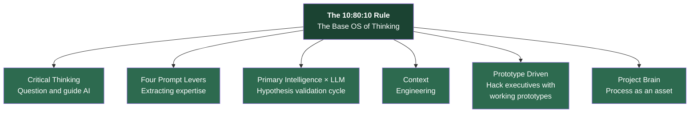
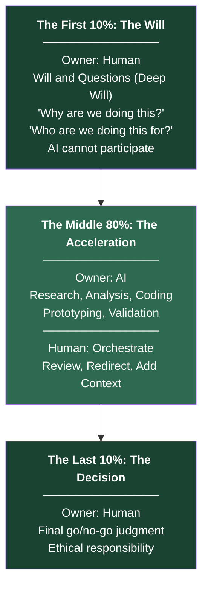
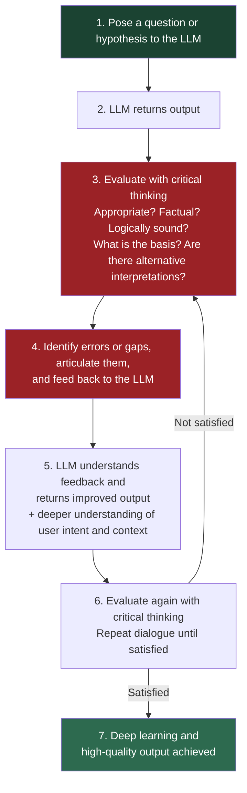
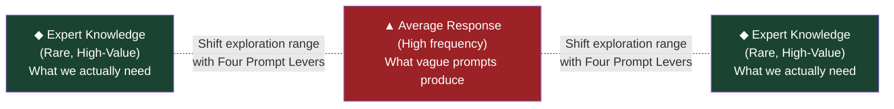
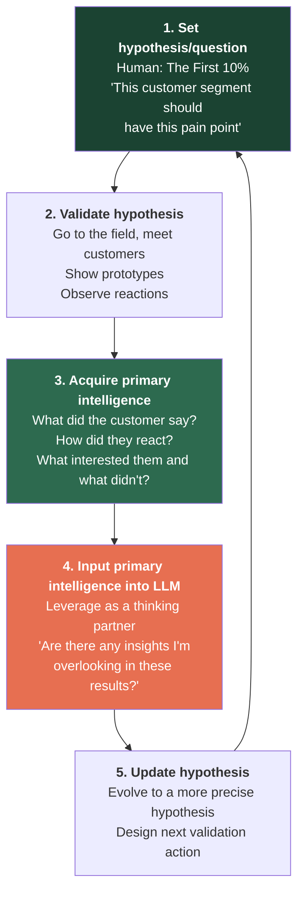
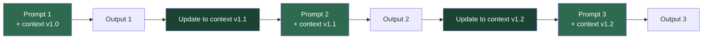
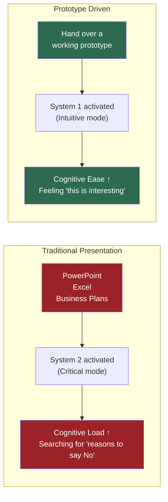
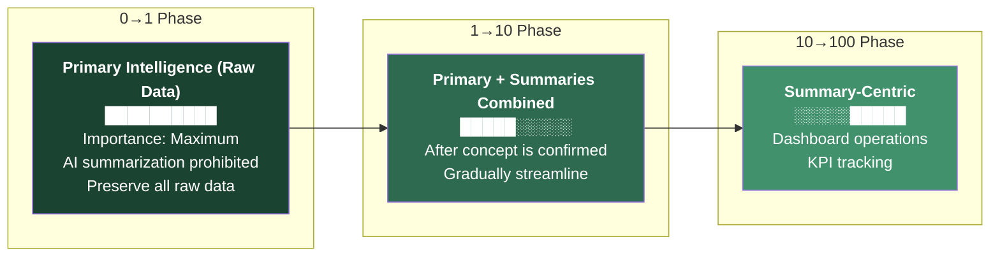
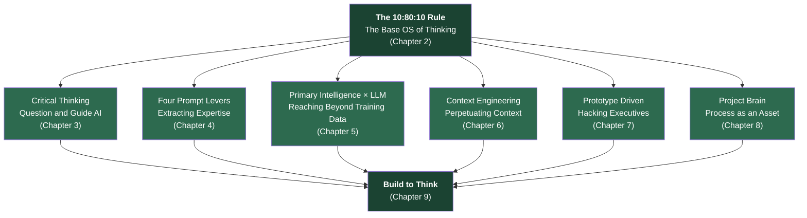

# Depth & Velocity: The Manifesto for Generative AI Business Development

> **"Logic implies, Emotion drives."**

<p align="center">
  
  <a href="http://creativecommons.org/licenses/by/4.0/"></a>
  
</p>

<p align="center">
  
</p>

# Chapter 1: Introduction — Why We Need a New OS

The essence of new business development does not change in the generative AI era.

Building new businesses remains a fundamentally human endeavor. "Decision" and "Will" are non-negotiable requirements. No matter how advanced AI becomes, only humans can answer the questions: "Why are we doing this?" and "Who are we doing this for?"

However, the traditional approach to new business development — spending months on market research, crafting the perfect PowerPoint, obtaining approval, and then beginning development — is no longer "too slow." **It is wrong.**

## The Four Structural Problems of Traditional New Business Development

Large enterprises face four structural problems in new business development.

**Problem 1: Slow validation.** It takes months from idea to completed prototype. During that time, the market shifts and customer needs evolve. By the time the prototype is finished, the hypothesis itself has become obsolete. In the process of communicating business requirements to engineers and having them implement the solution, "gaps in understanding" emerge, and the completed prototype diverges from the originator's vision. Requesting revisions costs additional weeks. And when you finally bring the finished prototype to a customer, they say: "Oh, another service already launched for that."

**Problem 2: Black-boxed processes.** The process of new business development exists only inside the originator's head. The history of deliberations, discarded ideas, and reasons for pivots — none of this survives in meeting minutes or PowerPoint decks. What remains are neatly formatted "minutes" and results-only "presentations." The context — why the team struggled, why they agonized, why they arrived at that particular decision — is entirely absent. Every time a team member changes, the same explanation must be repeated from scratch. When a project is frozen or disbanded, that context is lost forever, and the next team repeats the same debates and falls into the same traps.

**Problem 3: Structural friction with executive leadership.** Executives are professionals who have achieved outstanding results in their company's existing businesses and won the competition within the organization. That deserves respect. But their thought patterns have been optimized by decades of success in "existing business logic." In sports terms, they are masters of "baseball" (existing business) — they have won in a world measured by batting averages and ERAs. Meanwhile, new business is "soccer" — the rules, the muscles required, and the evaluation criteria are entirely different. When you try to explain this fundamentally different game using the formats of existing business — business plans, PowerPoints, Excel financial projections — structural friction is inevitable. They are not being malicious. They unconsciously judge new business proposals through the lens of their "existing business success experience."

**Problem 4: Knowledge evaporation.** When a project is frozen or disbanded, everything the team learned, experienced, and discovered evaporates from the organization. The next new business team repeats the same arguments and falls into the same traps. The organization cannot learn from new business "failures" because the process of "why it failed" was never recorded. All that remains is: "This project was discontinued."

These problems are not caused by individual incompetence. **The "operating system" of new business development is outdated.**

## The New OS: Depth & Velocity

We need a new OS. That OS is **"Depth & Velocity."**

Traditional new business development explores "broadly and shallowly," narrowing down to the single option with the highest probability. D&V takes the opposite approach: **"deep and fast."**

Using AI as leverage, D&V achieves depth of thought and speed of execution simultaneously. These two dimensions were traditionally in a trade-off relationship — thinking deeply meant slowing down, and moving fast meant staying shallow. AI has dissolved this trade-off.

According to a 2024 survey by Japan's Ministry of Internal Affairs and Communications, only 42.7% of Japanese companies have formulated a generative AI utilization policy, compared to 78.7% in the US, 80.6% in Germany, and 95.1% in China — a gap of up to 50 percentage points. MIT research has shown that generative AI usage improves the performance of highly skilled workers by nearly 40%. A US national survey found that workers using generative AI save an average of 5.4% of their working hours (approximately 2.2 hours per 40-hour work week).

These numbers demonstrate that AI is not a "convenient tool" but a "source of competitive advantage." D&V is the methodology that extracts this power of AI in a form optimized for new business development.

The D&V methodology consists of seven components:



The "10:80:10 Rule" sits at the top as the base OS of thinking, and the remaining six components are applications that run on top of it. This book explains each of the seven in sequence, then integrates them all under the philosophy of "Build to Think."

### References

1. Japan Ministry of Internal Affairs and Communications, "Survey on Information and Communications Technology R&D and Digital Utilization Trends" (2024) — Japan's generative AI policy adoption rate at 42.7%
   https://www.soumu.go.jp/johotsusintokei/whitepaper/ja/r06/pdf/n1510000.pdf

2. MIT Sloan, "How Generative AI Can Boost Highly Skilled Workers' Productivity" — 40% performance improvement with generative AI
   https://mitsloan.mit.edu/ideas-made-to-matter/how-generative-ai-can-boost-highly-skilled-workers-productivity

3. Federal Reserve Bank of St. Louis, "Impact of Generative AI on Work Productivity" (2024) — Workers save an average of 2.2 hours per week
   https://www.stlouisfed.org/on-the-economy/2025/feb/impact-generative-ai-work-productivity

---

# Chapter 2: The 10:80:10 Rule — The Golden Ratio of Human-AI Co-Creation

The AI era fundamentally redefines the roles of humans and AI in the workflow.

I call this the golden ratio of human-AI co-creation: **"The 10:80:10 Rule."** This ratio is the base OS that runs through the entire D&V methodology. AI is not a "replacement" but a "weapon" that amplifies human thought and capability. By providing the initial question, delegating the intermediate output process to AI, and having humans own the final decision, both the quality and quantity of outcomes are maximized.

## The First 10%: The Will

**Owner: Human**

The first 10% is work that only humans can do.

Defining the fundamental questions (Deep Will): "Why are we doing this?" and "Who are we doing this for?" AI cannot participate here. Only an almost obsessive personal passion can generate the initial velocity of a project.

AI generates "the statistically most plausible answer" from past data. But what ignites a new business is not "the statistically most plausible answer." It is an individual's obsession: "I cannot rest until I do this."

The Lean Startup teaches the "Build-Measure-Learn" cycle. Design Thinking starts with "empathy." But the very first step that sets the cycle in motion — "Why am I tackling this problem?" — is defined not by a framework, but by human will.

The moment you delegate this 10% to someone else — or to AI — the project becomes "a plan that belongs to no one." When an executive asks, "Why do you want to do this?", no one will believe an originator who reads out an AI-generated answer.

## The Middle 80%: The Acceleration

**Owner: AI Agents**

The middle 80% is where AI operates at overwhelming speed.

Research, analysis, coding, prototyping, validation. Processes that previously took humans months are compressed by AI into hours or days.

The critical point is that humans **must not do the manual work** in this phase. You **orchestrate** AI. Don't write the code yourself — have AI write it. Don't create the market research report yourself — have AI structure it. Don't design the prototype yourself — have AI generate it.

However, "orchestrating" is not "delegating blindly." Within the 80%, there are multiple human intervention points. You review AI's output midstream, correct the direction, and provide additional context. When AI drifts back toward the mean of the normal distribution, you use Prompt Levers (Chapter 4) to redirect it toward the expert domain.

NVIDIA CEO Jensen Huang stated: "If a $500,000-a-year engineer hasn't consumed half that in tokens by year-end, I'll be deeply concerned." The essence of this statement is not about consuming tokens for its own sake. It is about recognizing the value of **having AI execute 80% of the work at high speed, aligned with the direction that humans defined in the first 10%.**

## The Last 10%: The Decision

**Owner: Human**

The last 10% returns to human hands.

The final judgment on whether to release what has been created to the world. Ethical responsibility. AI presents options, but finding the answer to the question is always the human's task.

AI says: "The estimated market receptivity of this prototype is 68%." But deciding whether to bet on that 68% and commit resources is a human decision. And taking responsibility for the consequences of that decision is also human.

AI cannot take responsibility. Only the human who defined "why" in the first 10% can take responsibility.

The Harvard Business School research team's paper "Navigating the Jagged Technological Frontier" demonstrates that AI's capability boundary is "jagged" in shape. There are clear domains where AI surpasses humans and domains where it falls short. For tasks inside AI's frontier (where AI excels), using AI dramatically improves performance. For tasks outside AI's frontier (where AI struggles), humans who did not use AI performed better.

The 10:80:10 Rule is designed with this jagged frontier as a premise. The first 10% (will and questions) and the last 10% (decision and responsibility) lie outside AI's frontier. The middle 80% (research, analysis, implementation) lies inside AI's frontier. Humans and AI each maximize their strengths.



## Why "10:80:10"?

This ratio applies not only to new business development but to all intellectual labor in the AI era.

We have long assumed that "quantity and quality of output are in a trade-off relationship." But in the AI era, for the first time in human history, it has been proven that "quantity and quality can coexist through AI."

Those who use AI 24/7 as a thinking partner, running AI agents in parallel with their own work, do not merely double their output compared to those who don't use AI at all. They multiply it 3x, 5x, 10x.

The 10:80:10 Rule is the design principle for achieving this coexistence. The first and last 10% ensure "quality" through human judgment, while the middle 80% compresses "quantity" through AI. The result: Depth and Velocity achieved simultaneously.

### References

1. HBS, "Navigating the Jagged Technological Frontier" — AI's jagged capability frontier
   https://readwise-assets.s3.amazonaws.com/media/wisereads/articles/navigating-the-jagged-technolo/24-013_8f3583c2-2e9a-4379-9697-a93bd6a84133.pdf

2. Bill Gates, "The Age of AI Has Begun" (March 2023)
   https://www.gatesnotes.com/The-Age-of-AI-Has-Begun

3. Jensen Huang / NVIDIA — "Software is eating the world, but AI is going to eat software"
   https://www.technologyreview.com/2017/05/12/151722/nvidia-ceo-software-is-eating-the-world-but-ai-is-going-to-eat-software/

4. Martin Casado / Andreessen Horowitz — "Generative AI Brings Cost of Creation Close to Zero"
   https://www.wsj.com/articles/generative-ai-brings-cost-of-creation-close-to-zero-andreessen-horowitzs-martin-casado-says-58e061b4

5. Elon Musk / Neuralink — Vision to integrate AI as an additional layer of the brain
   https://techcrunch.com/2017/04/20/elon-musks-neuralink-wants-to-turn-cloud-based-ai-into-an-extension-of-our-brains/

---

# Chapter 3: Critical Thinking — The Process of Questioning and Guiding AI

The first skill to acquire when implementing the 10:80:10 Rule is **critical thinking.**

Why does critical thinking come first? The reason is simple. If you cannot correctly evaluate AI's output, the 10:80:10 Rule does not function. In the middle 80%, AI generates output. In the last 10%, humans judge it. The quality of that judgment is determined by critical thinking.

## Understanding How LLMs Work

Large Language Models (LLMs) — ChatGPT, Gemini, Claude — execute five internal steps between receiving your input and returning a response.

**STEP 1: Tokenization.** The input text is split into minimal data units called "tokens." For English, this roughly corresponds to words and subwords. A college student having AI write a report of about 7,000 characters consumes approximately 10,000 tokens.

**STEP 2: Vectorization.** Tokens are converted into N-dimensional vectors (arrays of numbers). "Dog" and "cat" are placed close together in vector space, while "dog" and "economics" are placed far apart. This mathematically represents the semantic relationships between words.

**STEP 3: Feature extraction.** Neural networks (the Transformer architecture) are used to capture the features of the vectorized data. In June 2017, a Google research team proposed the Transformer architecture in their paper "Attention Is All You Need." This concept became the foundational technology for LLMs and profoundly influenced all subsequent models — GPT, Gemini, Claude. The core of the Transformer is the "Self-Attention" mechanism, which simultaneously calculates the relationships between all tokens in the input. In the sentence "I walked my dog in the park," Self-Attention captures that "walked" relates to both "I" and "dog."

**STEP 4: Context comprehension.** Based on the features extracted in Step 3, the model comprehends the meaning and context of the entire text — not at the word level, but at the level of overall structure and intent.

**STEP 5: Decoding.** The data is converted into output format and text is generated. This is the most critical step. In decoding, vector data is transformed, and **the most statistically probable next word or phrase is selected** to create a natural response that humans can understand.

| STEP | Process | Description |
|:---|:---|:---|
| 1 | Tokenization | Split input into minimal "token" units |
| 2 | Vectorization | Convert tokens to N-dimensional vectors, numerically encoding semantic relationships |
| 3 | Feature extraction | Transformer (Self-Attention) calculates all inter-token relationships |
| 4 | Context comprehension | Comprehend overall structure and intent of the text |
| 5 | Decoding | **Select the statistically most probable next word and generate text** |

Step 5, the decoding process, holds the key. The LLM is not searching for "the correct answer." It is simply **continuously selecting "the next word with the highest statistical probability."**

**LLMs do not think. They are machines that weave words through "statistical prediction" and "probability theory."**

They possess no judgment criteria for "good vs. bad" or "correct vs. incorrect." Therefore, hallucination (output that diverges from fact) is fundamentally impossible to prevent. LLMs produce complete fabrications with extreme fluency and supreme confidence — and they themselves do not recognize that it is fabrication.

## What Is Critical Thinking?

Critical thinking is the practice of refusing to accept assumptions and premises at face value, asking "Is this really true?", and determining the essence and valid conclusions of matters based on evidence and logic.

The importance of critical thinking in business was recognized long before AI, but in the AI era, its importance has increased by orders of magnitude.

Why? Because AI output is extremely fluent, appears logical, and is persuasive. That is precisely what makes it dangerous. The moment a human reads fluent text, the brain tends to intuitively judge "this is correct." This is the "Cognitive Ease" bias identified by Daniel Kahneman (detailed in Chapter 7).

Generative AI output is often high quality. But there is no guarantee of truth. And once you start believing AI output uncritically, a habit of intellectual passivity sets in. Once that habit takes hold, you lose the ability to obtain output that contains truth.

## The "Question and Guide" Dialogue Process

The correct dialogue process with AI is not a one-way Q&A. It is an **iterative "question and guide" cycle.**



The core of this process is that **the human is in the position of "guiding" AI.** AI is like a highly capable subordinate. It responds to instructions with full effort, but if the quality of instructions is low, the quality of output will be low. It corrects itself immediately when errors are pointed out. But it will never say on its own: "Isn't this instruction problematic?"

By critically evaluating, providing feedback, and correcting direction, repeating this "question and guide" process causes two things to happen simultaneously:

**First:** The quality of AI output improves. Through repeated feedback, AI develops a deeper understanding of the user's intent and context, generating improved output.

**Second:** The human's own thinking deepens. In the process of asking AI "Why do you think that?" and critically examining the response, humans become aware of their own assumptions and biases. Dialogue with AI is also dialogue with oneself.

### References

1. Vaswani et al., "Attention Is All You Need" (2017) — Introduction of the Transformer architecture
   https://arxiv.org/abs/1706.03762

2. Globis MBA, "Critical Thinking" (2012) — The most widely referenced critical thinking text in the Japanese-speaking world
   https://amzn.asia/d/hHp87To

3. Sol Rashidi, "AI First: The Playbook for a Future-Proof Business and Brand"
   https://amzn.asia/d/dxoGKEf

4. Daniel Kahneman, "Thinking, Fast and Slow" — Cognitive Ease
   https://www.nobelprize.org/prizes/economic-sciences/2002/kahneman/lecture/

---

# Chapter 4: The Four Prompt Levers — Extracting Expertise from the "Average"

As of January 2026, major LLMs (ChatGPT, Gemini, Claude, etc.) are believed to have been trained on all publicly available data on the internet.

This fact implies two things:

**First:** LLMs can access the totality of knowledge that humanity has publicly shared. This is an extraordinary capability.

**Second:** When you input a vague instruction into an LLM, it outputs the "average response" with the highest statistical frequency — the answer from the center of the normal distribution curve. Because LLMs have been extensively trained on general knowledge, average information is most likely to be used.

What holds value in business is not the "average correct answer" that anyone could think of. It is the rare, sharp insights found at the tails of the normal distribution — "professional-grade knowledge."

The classic computer science adage **"Garbage In, Garbage Out"** applies perfectly to generative AI. Vague input yields vague output.



## Shifting to the Expert Domain with Four Levers

By combining four intentional techniques (levers), you forcefully shift the LLM's exploration range from "average" to "expert domain (minority)."

### Lever 1: Role Definition

Explicitly define an expert role for the LLM.

- "You are a world-class strategy consultant."
- "Respond as a UX design professional."
- "As a leading authority in [domain], review this critically."

Defining a role shifts the LLM's response distribution from "the median of general knowledge" to "knowledge within the specified expert domain." This is not a "prompt trick" but a structural technique based on LLM operating principles (Chapter 3). When the LLM selects the next word during decoding, role definition increases the probability of "vocabulary and logical structures used by strategy consultants" while decreasing the probability of "generic responses."

### Lever 2: Chain of Thought

Instead of demanding an immediate answer, have the LLM work through steps.

- "Think step by step."
- "First analyze the background, then identify the challenges, and finally propose solutions."
- "Before reaching a conclusion, consider three counterarguments."

By making the thinking process explicit, LLM reasoning shifts from shallow association to structured analysis. Wei et al. (2022) demonstrated in their research that chain-of-thought prompting significantly improves LLM reasoning capabilities.

### Lever 3: Few-Shot Examples

Show specific examples of "good output" and "bad output."

- "Please respond in the following granularity and tone (example: XXX)."
- "Rather than a generic response like YYY (bad example), I need more specialized analysis."
- "The previous output was good in these respects: ZZZ. Please maintain this quality."

By providing examples, the LLM understands the expected quality level and generates responses calibrated to that level. Brown et al. (2020) showed in the GPT-3 paper that few-shot learning is extremely effective in eliciting LLM capabilities.

### Lever 4: Constraints

Limit the scope of output to sharpen focus.

- "Respond in 300 words or fewer, focusing on the three most important points."
- "Analyze based on the Japanese market only, using data from the past 6 months."
- "Omit technical details and explain in language that executives can understand."
- "Include not only positive aspects but also risks and concerns."

By providing constraints, the LLM extracts only the portions of its vast knowledge that match the specified conditions. Without constraints, LLMs tend to "include everything that seems relevant," resulting in diffused focus.

## Combining the Four Levers

Each lever is effective individually, but **combining them multiplies the effect.**

| Combination | Effect | Example |
|:---|:---|:---|
| Role only | Access to expert-domain knowledge | "Analyze as a strategy consultant" |
| Role + Chain of Thought | Deep response with staged expert analysis | "As a strategy consultant, first analyze market structure, then evaluate competitive positioning, then propose entry strategy" |
| Role + Examples + Constraints | Expert response at a specific quality level within a limited scope | "As a McKinsey partner, at the following granularity, limited to the Japanese market, within 3 pages" |
| **All four** | **The most precise, professional-grade response** | Integrated prompt design with all levers |

By mastering these techniques, you gain access to professional-grade knowledge from any domain, on demand. Through sparring with these "experts," you deepen your own thinking, and the LLM becomes your thought partner for new business development. You effectively build your own "all-star team of experts."

Note: There are cases where you intentionally aim for "average responses" — for example, when using AI to conduct a general consumer receptivity survey before user interviews. In such cases, you remove the levers and deliberately elicit generic responses. The levers are not meant to be always-on; they are a technique to be applied according to purpose.

### References

1. Wei et al., "Chain-of-Thought Prompting Elicits Reasoning in Large Language Models" (2022)
   https://arxiv.org/abs/2201.11903

2. Brown et al., "Language Models are Few-Shot Learners" (2020) — GPT-3 and Few-Shot Learning
   https://arxiv.org/abs/2005.14165

3. Sol Rashidi, "AI First: The Playbook for a Future-Proof Business and Brand"
   https://amzn.asia/d/dxoGKEf

---

# Chapter 5: Primary Intelligence × LLM Hypothesis Validation Cycle — Reaching Beyond the Training Data

LLMs have been trained on all publicly available data on the internet. This is an extraordinary volume of knowledge, but it has a decisive limitation.

**What LLMs have learned is an aggregate of secondary information written by someone, somewhere in the world.**

The most valuable information in new business development — the **primary intelligence** you gained by seeing, hearing, feeling, and touching in the field — does not exist in the LLM's training data. Even in the AI era, the essence of new business development remains a human endeavor. Going to the field, facing customers, having them touch prototypes, and observing their reactions with your own eyes. The primary intelligence obtained through this process is the most rare and most valuable information that no one else possesses.

## Primary Intelligence Is the Vein of Gold in New Business Development

| Type of Information | LLM Training Status | Value in New Business | Acquisition Method |
|:---|:---|:---|:---|
| Publicly available internet data | Trained | General (not differentiating) | Accessible to anyone |
| Industry reports, academic papers | Trained | Moderate | Paid databases |
| Primary intelligence from the field | **Not trained** | **Highest** | Fieldwork only |
| Your interpretation of primary intelligence | **Not trained** | **Highest** | Your thinking only |

The information LLMs have trained on is "an aggregate of secondary information written by someone, somewhere in the world." While this represents an extraordinary volume of knowledge, it cannot be a source of differentiation since everyone has equal access.

On the other hand, primary intelligence — a single remark a user let slip during an interview, the change in facial expression when touching a prototype, the sense of discomfort when actually using a competitor's service — this is valuable information that AI has not learned and no one else knows.

## Designing the Hypothesis Validation Cycle

The cycle of inputting primary intelligence into the LLM and leveraging it as a thinking partner is the execution engine of the D&V methodology.



**Step 1 — Set hypothesis (The First 10%):** Formulate a new business hypothesis. "This customer segment should have this pain point." "This solution should make them willing to pay $500/month." The quality of this question determines the outcome of the entire cycle.

**Step 2 — Validate hypothesis (fieldwork):** Go to the field with your hypothesis. Interview customers. Show prototypes. Observe reactions. Be wary of "confirmation bias" — don't just collect information that supports your hypothesis. Actively seek information that contradicts it.

**Step 3 — Acquire primary intelligence:** What did the customer say? How did they react? What interested them and what didn't? This is primary intelligence. Critically, do not "summarize" this information (detailed in Chapter 8). Interview transcripts should be preserved in full.

**Step 4 — Input into LLM:** Feed this primary intelligence into the LLM. Ask: "Based on the following interview results, please evaluate the validity of our hypothesis. Also, please point out any insights we might be overlooking." This is where Chapter 3's critical thinking and Chapter 4's prompt levers come alive.

**Step 5 — Update hypothesis:** Incorporate the LLM's suggestions to update your hypothesis. Then go back to the field.

By running this cycle at high speed, "high-confidence hypotheses" that do not exist in the LLM's training data are constructed. **The LLM has the map, but you know the terrain.** When you combine the map and the terrain, the most precise route becomes visible.

## Why This Cycle Is Fundamentally Different from Traditional Approaches

The Lean Startup's Build-Measure-Learn cycle also advocates iterative hypothesis validation. What makes D&V's Primary Intelligence × LLM cycle fundamentally different is that **the LLM intervenes between validation and the next hypothesis.**

In traditional cycles, interpretation of validation results happened inside the human's head. The originator interprets 10 interview results using their own experience and intuition to formulate the next hypothesis. This is subject to the originator's confirmation bias, experience limitations, and cognitive constraints.

In the D&V cycle, validation results (primary intelligence) are fed into the LLM. The LLM presents new suggestions based on patterns the originator overlooked or knowledge from outside the originator's domain. Of course, these suggestions are also verified through Chapter 3's critical thinking, but a structure emerges where **AI compensates for the limitations of human cognition.**

### References

1. Eric Ries, "The Lean Startup" (2011) — Build-Measure-Learn hypothesis validation loop
   https://theleanstartup.com/

2. Steve Blank, "The Four Steps to the Epiphany" (2005) — Customer Development Model and the importance of primary intelligence
   https://steveblank.com/

3. HBS, "Navigating the Jagged Technological Frontier" — The boundary between AI's strengths and weaknesses
   https://readwise-assets.s3.amazonaws.com/media/wisereads/articles/navigating-the-jagged-technolo/24-013_8f3583c2-2e9a-4379-9697-a93bd6a84133.pdf

---

# Chapter 6: Context Engineering — From Prompts to Context

Many people focus on "prompt engineering" when using AI — the technique of obtaining desired results from a single instruction. They design elaborate prompt templates with commands, constraints, inputs, and output formats, expecting a perfect 100-point answer.

But in new business development, prompt engineering has a structural limitation.

## The Limits of Prompt Engineering

Prompt engineering is a method for producing the correct answer in a **"1-Shot" (single instruction).**

The problem is that new business development is not the kind of endeavor where a single shot yields the correct answer. New business involves uncertainty, constant change, and evolving context. This week's hypothesis may be overturned by next week's interview results. Last month's direction may require revision due to this month's competitive moves.

Furthermore, prompt engineering **cannot reuse outputs across conversations.** There is no mechanism to carry forward the context built in Prompt A to Prompt B. Every time you open a new chat, context resets to zero.

**In the uncertain, constantly changing world of new business development, inflexible prompt engineering is not viable.**

## What Is Context Engineering?

"Context Engineering" was first proposed by Walden Yan, co-founder of US AI technology company Cognition. It refers to the systematic creation of mechanisms for automatically organizing and propagating historical information — defined as an essential concept for executing multi-AI-agent systems.

Yan defined this as a concept needed for "inter-AI-agent" coordination, but **I believe it should be extended to the "human-AI" co-creation relationship.**

In more general terms, it means structurally managing the context of new business development activities — the history of deliberations, acquired primary intelligence, reasons for pivots, discarded ideas and their rationale — and bringing this context into every dialogue with the LLM. The key is to "permanently preserve and cultivate the thinking process and context of new business development through dialogue."

This is context engineering for new business development.

## Designing and Operating the Context File

The concrete implementation uses a **context file** that records the contextual information of new business development. The context file is a "living record" of the project.

There is no fixed format for context files, but the following structure is practical. Once created, the file can be updated by the LLM through ongoing project activities.

```markdown
# Context File

**Project:** Construction DX SaaS for Mid-Tier General Contractors "Site-Log" (tentative)
**Business Phase:** Problem Exploration / Problem-Solution Fit Validation (MVP not yet developed)
**Last Updated:** 2026-01-28

## 1. Project Objectives and Goals
- **Near-term goal**: By April 2026, find one construction site
  where they say "I'd pay to solve this" and obtain agreement to develop MVP.
  - *Current status:* Interviewed site managers at 15 companies, but received
    "Nice to have, but won't pay" and "Current methods (paper/Excel) work fine."
- **Target**: Mid-tier general contractors with revenue of ¥30-50 billion
- **Core value being explored**: Haven't found "the one" yet.
  Initial "overtime reduction" pitch didn't resonate. Now exploring
  whether "safety risk reduction" or "drawing management" might be the vein.

## 2. Absolute Constraints of the Field
- **Legal/contractual constraints**:
  - Paper culture: Many government submissions require "paper originals."
    If DX tools still require "print → stamp," the field sees it as
    "just more work."
- **Physical/environmental constraints**:
  - Devices: Sites have only "one shared old digital camera."
    iPad rollout hasn't reached most sites.
  - Network: Basements and mountain areas have no signal.
    Cloud-based tools are dismissed instantly.

## 3. Decisions and Discovered Insights
### Phase 1: Defeat of the "Efficiency" Hypothesis (Months 1-2)
- **[2025-08-10] Discovery: "Overtime reduction" is not a magic word**
  - *Hypothesis:* "Automate paperwork so you can go home earlier" should be welcome.
  - *Fact:* A 50-year-old site manager said "Paperwork includes reviewing
    the day's site work — that's an important task. Automating it is nonsensical."
  - *Insight:* "Paperwork automation" is HQ logic. We failed to grasp
    the field reality that "some paperwork cannot be automated."

## 4. Current Challenges Requiring Resolution
- **Challenge #01: Absence of a "Killer Pain"**
  - No pain severe enough for "I'd pay ¥50,000/month right now."
  - *Question:* Where is the pain so acute that a site manager would
    "secretly use it even if paying out of pocket"?
```

Note the time-series recording of "hypothesis," "fact," "insight," and "decision" in this sample. The reason why an idea was discarded three months ago is also documented.

## Context File Operating Flow

The critical requirement is to **keep the context file continuously updated.** As project activities progress, policies change, new primary intelligence comes in, and hypotheses are updated. The context file reflects all of this.



By loading the context file at the beginning of each chat session, the LLM starts every dialogue **with full understanding of the project's context.** Even when you open a new chat, context does not reset to zero. The context file guarantees the permanence of context.

If prompt engineering is the approach of "aiming for 100 points with a single instruction," then context engineering is the approach of "accumulating context so that precision improves with every dialogue." For processes like new business development, where hypotheses are refined amid uncertainty, the latter approach is overwhelmingly more appropriate.

### References

1. Walden Yan / Cognition, "Context Engineering" — First publication of the concept
   https://www.philschmid.de/context-engineering

2. Philipp Schmid, "Context Engineering for AI Agents"
   https://www.philschmid.de/context-engineering

---

# Chapter 7: Prototype Driven — Hacking Executives with Working Prototypes

The most frequently repeated tragedy in new business development:

**An originator pours their soul into a business plan, which is then rejected by executives applying "existing business logic."**

This tragedy is not caused by the originator's lack of ability. Nor by executive malice. It is a **structural problem explainable through cognitive science.** This chapter dissects the structure through the lens of Nobel laureate Daniel Kahneman's theories and presents a methodology for breaking through with "working prototypes."

## Why Executives Reject New Business Proposals

Executives are professionals who achieved outstanding results in existing businesses and won the competition within the organization. That deserves respect. But their thought patterns have been optimized by decades of success in "existing business logic."

In sports terms, they are masters of "baseball" (existing business). New business is "soccer" — entirely different rules, muscles, and evaluation criteria.

| | Existing Business | New Business |
|:---|:---|:---|
| Operating principle | Efficiency | Massive action volume |
| Decision criteria | Precedent-based | No precedent |
| Business model | Established | Being explored |
| Environment | Certainty | Uncertainty |
| Risk | Minimize | Don't fear |
| Success metric | KPI achievement | Speed of learning |
| Time horizon | Quarterly to annual | Weekly to monthly |

They are not being malicious. They fully understand the importance of new business as executives. They know that existing business growth alone will not sustain the company. Yet despite this understanding, they unconsciously judge new business proposals through the lens of "existing business success experience." They are unaware of their own contradiction. But unless you break through their cognitive patterns, you cannot advance new business development.

## Kahneman's Dual Process Theory

We analyze this structure through Nobel laureate Daniel Kahneman's "Dual Process Theory."

The human brain has two thinking modes:

| | System 1 (Fast Thinking) | System 2 (Slow Thinking) |
|:---|:---|:---|
| Nature | Intuitive, emotional, automatic | Logical, critical, conscious |
| Cognitive load | Low | High |
| Example | Computing "2+2" | Mental arithmetic "17×24" |
| Attitude toward new business | Intuitively "interesting" | Logically "too risky" |

When presented with unfamiliar new business concepts through thick presentation materials, executives experience intense **"Cognitive Load."** They're being asked to process "soccer" rather than their familiar "baseball." Unfamiliar rules, unfamiliar ways of thinking, unfamiliar cognitive demands.

When the brain feels stressed, it activates **System 2 (critical mode)** as a defensive mechanism to conserve energy. The brain enters alert mode and begins to doubt the information in front of it. In the limited time busy executives have allocated, showing them complex Excel tables triggers System 2 to search for "reasons to say No."

**This is the cognitive science mechanism by which new business proposals get "judged by baseball rules in a soccer game."**

## Activating the Right Brain with Cognitive Ease

Kahneman also proposed another concept: **"Cognitive Ease."**

The human brain has a bias toward intuitively judging "things that are easy to see and understand" as "true and low-risk." This is also known as the "illusion of truth."

Working prototypes promote this cognitive ease. PowerPoint text is abstract — the brain must strain System 2 to decode it. But handing someone a smartphone and saying "Please tap" creates bodily experience through fingertip interaction, enabling intuitive understanding of the service's value.



## Embodied Cognition

Cognitive science includes the theory of "Embodied Cognition" — the idea that human cognition is not completed by the brain alone but is deeply intertwined with bodily experience.

Cangelosi & Stramandinoli (2018) suggest that abstract concepts are understood more deeply through concrete, bodily experience than through verbal explanation alone.

Rather than verbally explaining "an innovative UX," hand them a smartphone, let their fingertips tap, and let them experience the screen transitions. **The working prototype is the highest-resolution information transmission medium for installing the value of a business into executives' minds.**

## Vibe Coding — The Ultimate Weapon

This is where **Vibe Coding** enters.

Named by OpenAI co-founder and former Tesla AI Director Andrej Karpathy on X, this approach means "giving AI natural language instructions to write code." It is a fundamental departure from the traditional style of "humans meticulously writing code."

Vibe coding transforms new business development for two reasons:

**Reason 1: The "thinker" becomes the "maker."** Previously, communication gaps emerged when conveying business requirements to engineers. Prototype development required at least a month plus approval for engineering resources. With vibe coding, the originator can personally create a working app in hours that matches their vision.

**Reason 2: Hypothesis validation cycles become ultra-fast.** Formulate a hypothesis, build a working prototype, and bring it directly to customers for validation — the originator handles the entire cycle. If the reaction is poor, modify on the spot or discard and rebuild. Conceive an idea in the morning, build a working prototype by lunch, show it to a customer (or your boss) in the afternoon. With AI-minimized prototype development costs, "build many, discard many to find the answer" — true agile development — is now possible.

Numerous vibe coding tools have emerged. For those who have never written code, Replit, bolt.new, Lovable, and Claude Code are recommended. Claude Code by Anthropic made a worldwide impact; as of early 2026, Claude Code accounts for 4% of all public GitHub commits, with projections to exceed 20% by year-end.

## Wessel's "Inverted U" — The Courage Not to Over-Polish

When showing prototypes to executives, the assumption "we must show something perfect to be respectful" backfires.

Wessel's research shows that the relationship between "Fidelity" (completeness) and "funding success rate" in crowdfunding follows an inverted U-curve. **Medium fidelity (70% completeness) produces the highest results.**

A 100% complete prototype invites executives to sit in the "judge's seat" and start finding flaws. But at 70% completeness — "We've implemented only the core experience. Could you please touch it and advise whether this payment flow feels right from your perspective?" — the situation transforms.

## Turning "Enemies" into "Allies" with the Endowment Effect

If an executive says "Hmm, for this kind of service, I think this messaging would work better" — that is a major opportunity.

At that moment, the prototype transforms from "the originator's plan" into "**a plan that includes their opinion (= their own thing).**"

This is an application of the **"Endowment Effect."** People feel attachment and higher value toward "things they own" or "things they contributed to" beyond their objective worth. If the executive's minor suggestion can be fixed on the spot, do it right there with vibe coding. "I've made the change you suggested — what do you think?" A real-time co-creation experience made possible precisely because you can vibe code.

### References

1. Daniel Kahneman, "Thinking, Fast and Slow" — Dual Process Theory, Cognitive Ease
   https://www.nobelprize.org/prizes/economic-sciences/2002/kahneman/lecture/

2. Daniel Kahneman, Nobel Lecture (2002) — Academic foundation of Dual Process Theory
   https://www.nobelprize.org/uploads/2018/06/kahnemann-lecture.pdf

3. Cangelosi & Stramandinoli, "A review of abstract concept learning in embodied agents and robots" (2018) — Embodied Cognition
   https://pmc.ncbi.nlm.nih.gov/articles/PMC6015819/

4. Andrej Karpathy — Naming of Vibe Coding
   https://x.com/karpathy/status/1886192184808149383

5. Wessel et al., "The Role of Prototype Fidelity in Crowdfunding," Journal of Business Venturing (2022) — Inverted U-curve
   https://ideas.repec.org/a/eee/jbvent/v37y2022i4s0883902622000325.html

6. Anthropic, "The Impact of Claude Code on Software Development"
   https://www.anthropic.com/research/impact-software-development

7. Claude Code — Anthropic Official
   https://claude.com/product/claude-code

---

# Chapter 8: Project Brain — Process as an Asset

This chapter presents the most original and practically impactful concept within the D&V methodology.

An objective investigation conducted in March 2026 confirmed that Project Brain is **a world-first** as a new business development methodology. Existing methodologies — Lean Startup, Design Thinking, Jobs-to-Be-Done, Business Model Canvas — all focus on "what to build," "who to serve," or "how to validate." **None place "how to record and reuse the process itself" at the core of their methodology. Project Brain is the first to do so.**

## The Four Structural Problems of New Business Development Processes

What remains on the scene of new business development is neatly formatted "meeting minutes" and results-only "PowerPoint decks." The context — why the team struggled, why they agonized, why they arrived at that particular decision — is entirely absent. When a project is frozen or disbanded, that context is lost forever. And the next team repeats the same debates and falls into the same traps.

The field of new business development is "a series of pivots." Teams face questions with no right answers, formulate and discard countless hypotheses daily, and build new ones. The process contains tremendous energy and innumerable "branching points of thought." Yet none of those branching points are recorded anywhere.

**Problem 1: Black-boxed processes.** The history of past deliberations exists only in the originator's memory. No third party can trace "what deliberation process was followed." Six months have passed since project inception, with dozens of meetings and multiple pivots — yet no one other than the originator can trace that trajectory.

**Problem 2: The originator's own memory degrades.** Through repeated pivots, even the originator loses the ability to comprehensively track "when did what happen, what policy changes were made, and why." Human memory deteriorates. Who said what in a meeting three months ago, and why option A was chosen over option B — even the originator cannot accurately recall.

**Problem 3: Inefficient onboarding.** Every time a new member joins, the same explanation must be repeated from scratch. Even after explanation, the originator's passion, deliberation history, and realistic primary intelligence from past activities fail to transfer. New members enter discussions in a state of "I understand the outline, but I don't really grasp why we ended up with this direction." As a result, previously settled points get revisited, and the team's discussion regresses.

**Problem 4: Knowledge evaporation.** When a project is disbanded or frozen, everything the team learned, experienced, and discovered evaporates. Past insights are neither reflected in nor leveraged for the organization's next new business effort. Because the process of "why it failed" was never recorded, the organization repeats the same failures.

## The Sweet Trap Called "AI Summarization"

Many new business teams are choosing the wrong solution to these problems: **"summarization by generative AI."**

- The moment a meeting ends, they read the AI-generated summary of the Zoom transcript and only consume the meeting highlights.
- When researching something, instead of reading primary sources, they ask AI: "Give me a summary of this document" or "Extract just the key points."
- When unable to attend a user interview, they receive only the interview summary.

New business development is drowning in information. Information fatigue is real. The more information you collect, the greater the cognitive burden of interpreting it. We instinctively turn to AI to reduce that burden.

**However, let me state this unequivocally: In the 0→1 phase of new business development, relying on casual "AI summarization" is an act that must be absolutely avoided.**

Why? Because the seeds of new business (insights) do not exist within logically polished "key points." They always lurk within **primary intelligence.**

- The "hesitation" when a team member was about to speak but held back
- The "discomfort" of something feeling logically correct but intuitively wrong
- The "one remark" a user let slip during an interview
- The "idea" that was laughed off during brainstorming

AI summarization strips all of these away. Summarization is the act of compressing information. What is lost in compression is not numbers or facts but **nuance, passion, and context.** And that is precisely the information that becomes the seed for the next pivot.

Analysis on Medium suggests that 79% of AI summaries miss critical insights. In academia, Jowsey et al. (2025) reports that 419 researchers across 32 countries signed a statement rejecting generative AI use in reflexive qualitative research, arguing that AI erases the human voice. Primary intelligence in new business development is itself "the human voice."

## Adjusting Information Handling by Business Phase

Not every phase requires full-text preservation of primary intelligence. In the 0→1 phase, where the right answer is not yet visible, primary intelligence is the seed for the next pivot. As the business concept solidifies, the team gradually transitions to more efficient information handling.



## What Is Project Brain?

What is needed is not stripping information down. It is preserving the raw thought process of the ongoing new business — in all its resolution and passion — as an asset.

What I propose is building a **"Project Brain"** to preserve this raw data as an asset.

Project Brain is a **"second brain"** that ingests all of a project's "raw data," comprehends the context, and operates alongside the team as a member.

The tool I am currently most confident is optimal for realizing Project Brain is Google NotebookLM.

### Why NotebookLM Is Optimal

**Reason 1: You can control the information sources (anti-hallucination).** General-purpose LLMs like ChatGPT plausibly hallucinate about things they don't know. NotebookLM, by contrast, reasons exclusively from "materials uploaded by the user." "This Brain knows nothing except our project." This constraint is the most powerful weapon in new business development.

**Reason 2: RAG made accessible.** Normally, loading large volumes of proprietary data into AI requires engineers to build a RAG (Retrieval-Augmented Generation) system. NotebookLM accomplishes this with drag-and-drop of PDFs, text files, and audio data. The project's "second brain" can be built without a single engineering resource.

**Reason 3: Superior UI/UX as a "thinking partner."** Most AI tools use a "chat" UI, but NotebookLM is designed around the metaphor of "notes (thinking and preserving)." The UI/UX supporting the process of "deepening thought through AI dialogue" is exceptionally well-suited to the answer-less process of new business development.

**Reason 4: Rich feature set.** NotebookLM now includes a Deep Research function, making it a powerful weapon for external environment research as well.

## What to Input — Growing the "Brain" as a Whole Team

Three types of data should be fed into Project Brain. There is no need to create "polished materials." Input all unprocessed "raw data" into NotebookLM.

**1. Full transcripts of every meeting.** Regular meetings, team meetings, board meetings — all of them. Not the summary version, but the full text of the transcript. It doesn't matter if filler words like "um" and "uh" are included. What matters is the nuance information: "who, at what moment, with what intensity, said what." Upload text files transcribed from Zoom or Google Meet recordings, labeled with date and meeting name. These become the data that reveals when, by whom, and in what context the critical branching-point comments were made.

**Critical Tip:** Transcripts auto-generated by Zoom or Google Meet lack contextual information. By using the recording data, the raw transcript, and context-bearing project information as three inputs, then re-generating the transcript with an LLM like Gemini, transcription accuracy improves dramatically.

**2. All intermediate deliverables.** Every document created — Miro boards, photographs of whiteboard scrawls, competitive analyses, concept designs, market sizing. What matters is preserving "the branching routes leading to conclusions." Why was option A chosen over option B? Why did option C disappear? These "disappeared options" become a treasure trove when future pivots occur.

**3. Full transcripts of every user interview.** Input full transcripts of all user interviews conducted for receptivity validation. This dramatically streamlines the process that was previously done through design thinking interview analysis, enabling insights from perspectives and angles that humans would miss. Asking "From the last 10 interviews, find common latent challenges" yields instant insight. However, relying solely on AI is not acceptable — reviewing the primary intelligence yourself and finding insights with your own mind remains a MUST.

## Project Brain Use Cases

### Case 1: A Fact-Based Sparring Partner

Project Brain serves as a partner for fact-based sparring, grounded in all accumulated primary intelligence.

Humans inevitably cling to hypotheses they have believed (confirmation bias). They are also dragged by "sunk costs" ("we've come this far"), delaying exit decisions. But Project Brain derives answers from facts.

Ask "Is our hypothesis really correct?" and it responds based on interview records: "80% of users showed interest in your hypothesis. Specifically..." Primary intelligence that had been lost from the team's memory guides the team's direction.

### Case 2: Systematized Onboarding for New Members

When a new member joins, simply tell them: "Ask this Project Brain about 'the evolution of our concept, the current biggest issue, and a list of discarded ideas.'" That's it. The new member can participate in discussions understanding the full context, as if they had been on the project from the beginning — with access to all the same primary intelligence as the originator.

### Case 3: Excavating Business Opportunities Through Contextual Search

Because Project Brain has learned all primary intelligence from project inception, you can review the project's trajectory together with NotebookLM and uncover valuable business opportunities.

What deliberation process led to the current business concept? It is impossible for even the originator to perfectly recall the full trajectory of an intense, fast-paced journey.

"We discussed a similar idea before — why didn't we pursue it?" Project Brain answers instantly: "It was considered three months ago, but was shelved because a technical constraint was the bottleneck. However, with the current pivot plan, the technical issue is solvable." The moment that a past "No" becomes a "Yes" due to changed circumstances — Project Brain never misses it.

### Case 4: Additional Use Cases

| Use Case | Specific Question |
|:---|:---|
| Extracting user interview insights | "From the last 10 interviews, find common latent challenges and extract insights" |
| Identifying critical statements | "Someone said something like XX to me but I can't recall the details — who said what, and when?" |
| Creating intermediate deliverables | "Design a storyline for the executive report based on all deliberations to date" |

This is what "making the process an asset" means. Past discussions, discarded ideas, the passion of the moment — all of it is revived as evidence supporting "today's decision."

## Positioning as a World-First Methodology

The objective investigation conducted in March 2026 compared the following prior art to verify Project Brain's originality:

| Methodology | Core Claim | Treatment of Process as Asset |
|:---|:---|:---|
| Lean Startup (Eric Ries, 2011) | Build-Measure-Learn hypothesis validation loop | Not addressed. Focused on pivot decisions |
| Design Thinking (d.school / IDEO) | Empathize → Define → Ideate → Prototype → Test | Not addressed. Focused on insight extraction |
| Jobs-to-Be-Done (Clayton Christensen) | Identify the "job" customers "hire" | Not addressed. Focused on customer understanding |
| Business Model Canvas (Osterwalder) | Visualize business model with 9 elements | Not addressed. Snapshot-type tool |
| Tiago Forte, "Building a Second Brain" (2022) | Personal productivity method | Individual scope. Not for team new business |
| Deloitte Tohmatsu (2026/2/12) | AI-driven knowledge management cycle | Consulting KM. Does not target 0→1 |
| **Project Brain (2026)** | **Ingest 0→1 process primary intelligence into RAG and operate as "second brain"** | **Core of methodology. World-first** |

Project Brain's five core claims:

1. In the 0→1 phase, explicitly prohibit AI summarization and mandate raw data preservation of primary intelligence (meeting transcripts, interview records, whiteboard photos, etc.)
2. Ingest that raw data into a RAG tool (NotebookLM) to construct the project's "second brain"
3. Employ a design philosophy that adjusts information handling in stages as the business phase progresses (0→1 → 1→10 → 10→100)
4. Define use cases specific to new business development (fact-based sparring, new member onboarding, business opportunity excavation)
5. Position all of the above within a coherent framework (D&V) as a "new business development methodology"

No prior art integrating these five elements was found within the scope of the investigation.

### References

1. Google NotebookLM — RAG-based thinking support tool
   https://notebooklm.google/?hl=ja

2. "Project Brain Objective Evaluation Summary" (March 26, 2026) — World-first determination based on prior art investigation (verified with 14 references)

3. Tiago Forte, "Building a Second Brain" (2022)
   https://fortelabs.com/blog/basboverview/

4. Deloitte Tohmatsu, "AI-Driven Knowledge Management Cycle" (February 12, 2026)
   https://www.deloitte.com/jp/ja/services/consulting/blogs/ai-driven-knowledge-management-cycle.html

5. Jowsey et al., "We Reject the Use of Generative AI for Reflexive Qualitative Research," Qualitative Inquiry (2025)
   https://journals.sagepub.com/doi/full/10.1177/10778004251401851

6. Medium, "Stop Using AI for Summaries — Here's Why 79% Miss the Point" (January 2026)
   https://medium.com/ai-tomorrow/stop-using-ai-for-summaries-heres-why-79-miss-the-point-and-what-to-use-instead-77b2ef1c2a7b

---

# Chapter 9: Build to Think

The philosophy that runs through the entire D&V methodology can be expressed in a single phrase:

**"Build to Think."**

Not think first, then build. Build while thinking.

## From "Think to Build" to "Build to Think"

Traditional new business development was "Think to Build." Think first, plan, obtain approval, then build. Three months for market research, two months for business plan development, one month for the approval process, six months for development. A product completed over the course of a year arrives at market only to reveal: "This isn't it."

D&V is "Build to Think."

Formulate a hypothesis and build a prototype that same day with vibe coding (Chapter 7). Show it to a customer the next day. If the reaction is poor, discard it on the spot and rebuild. Run this cycle using the 10:80:10 Rule (Chapter 2).

In the first 10%, pose the question. In the 80%, have AI generate the prototype. In the last 10%, observe the customer's reaction and judge. When judging, use critical thinking (Chapter 3) to eliminate your own biases. When instructing AI, use the Four Prompt Levers (Chapter 4). Feed primary intelligence gained in the field into the LLM hypothesis validation cycle (Chapter 5). Perpetuate the project's context through the context file (Chapter 6). And accumulate the entire process in Project Brain (Chapter 8).

The time required for one cycle: hours to days.

A traditional year is decomposed into dozens of cycles in D&V. The learning from a single cycle may be small. But the learning accumulated after running dozens of cycles at high speed is far deeper than a single "big bet" taken over a year. And that learning is entirely recorded in Project Brain. Each subsequent cycle builds on the learning of the previous one.

## The Full Picture of the D&V Methodology

Let us re-integrate the seven components explained in this book.



## Don't Build Documents. Build the Business.

The left brain (System 2) uses AI research to rapidly shore up the logical foundation — traditional logic and market research. The right brain (System 1) uses vibe coding to build "working things" that hack the intuition and emotions of executives.

Run hypothesis validation at overwhelming speed, and within that process, discover the essence that only humans can reach.

AI has the map. But only a human can walk the terrain of the new business frontier, listen to the customer's voice, place the prototype in their hands, and reach that moment within their reaction when you feel: "This is it."

D&V is the methodology for accelerating that human endeavor tenfold through the leverage of AI.

**Depth and Velocity. Both, simultaneously.**

This is the new business development methodology for the generative AI era.

### References

1. D&V GitHub Repository (Leading.AI, CC BY 4.0 / MIT License)
   https://github.com/Leading-AI-IO/depth-and-velocity

2. Project Brain — note article (Japanese)
   https://note.com/satoshi_yamauchi/n/n09b085a5afbe

3. "Are You Fooled by 'AI Summaries'?" — note article (Japanese)
   https://note.com/satoshi_yamauchi/n/ne9d8639c0500

4. "Vibe Coding Transforms New Business Validation Cycles" — note article (Japanese)
   https://note.com/satoshi_yamauchi/n/n3e4e91cdbd26

5. "Cognitive Science Methodology for Breaking Through Executive Gates" — note article (Japanese)
   https://note.com/satoshi_yamauchi/n/nec9d9bbcb3e9

6. "Tiny Team Startups and Solopreneurship" — note article (Japanese)
   https://note.com/satoshi_yamauchi/n/n10dddcb73cec

7. Andrej Karpathy — "The era of Vibe Coding is over. The shift to Agentic Engineering begins."
   https://x.com/karpathy/status/1886192184808149383

## Author & Maintainer

**Satoshi Yamauchi** (山内 怜史)
*(AI Strategist & Business Designer)*
**[📒 Read my insights on Note](https://note.com/satoshi_yamauchi)**
*(Founder / AI Strategist at Leading.AI)*
**[🌐 Visit Leading.AI Official Website](https://www.leading-ai.io/)**

## License

This work is licensed under [Creative Commons Attribution 4.0 International (CC BY 4.0)](http://creativecommons.org/licenses/by/4.0/).
You are free to share and adapt this material, provided you give appropriate credit to **Satoshi Yamauchi / Leading AI**.
