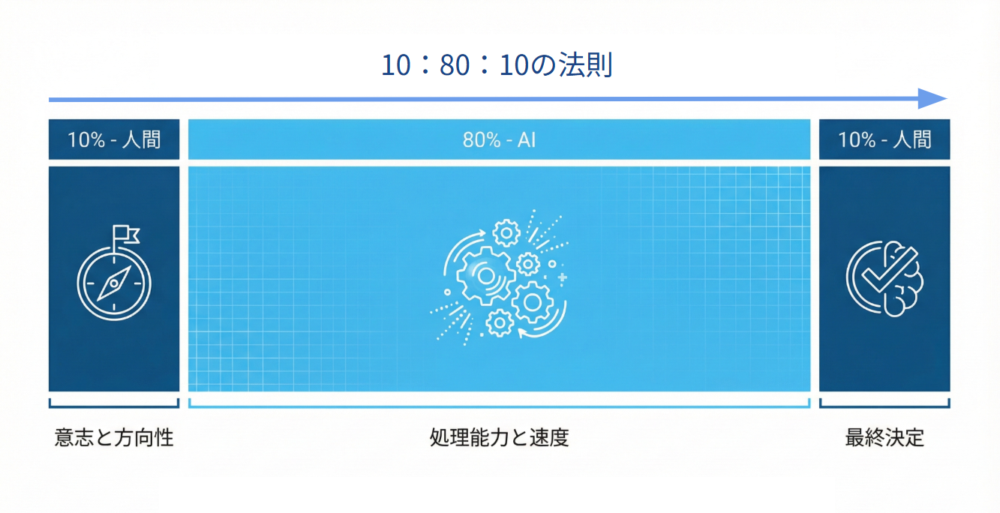
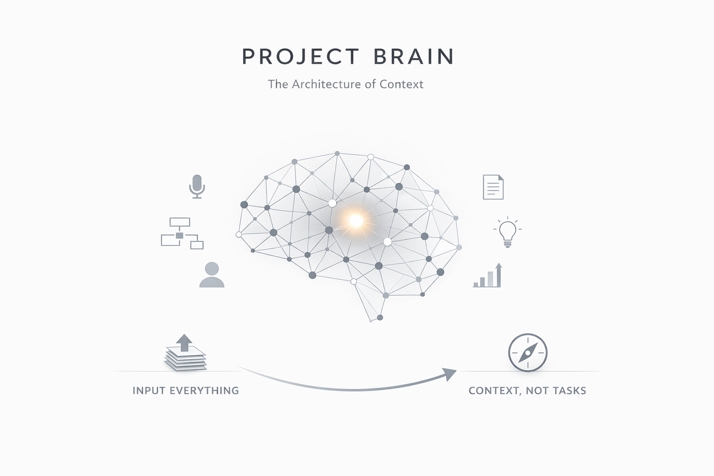
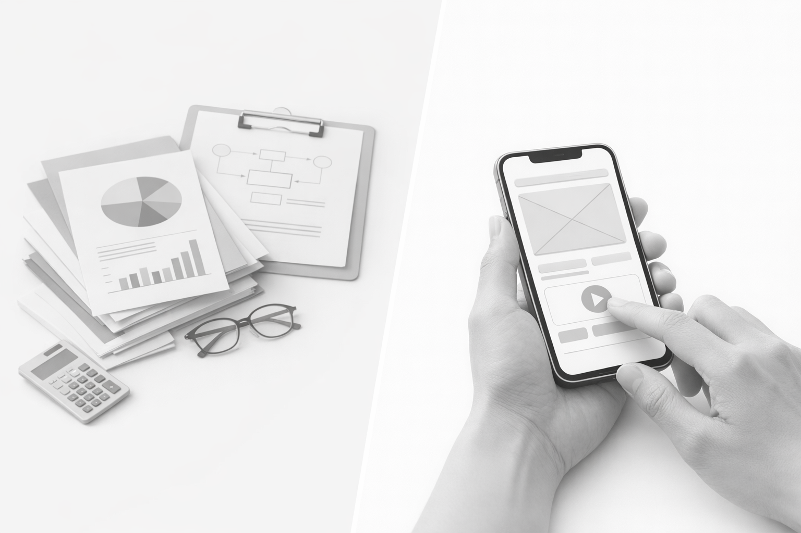
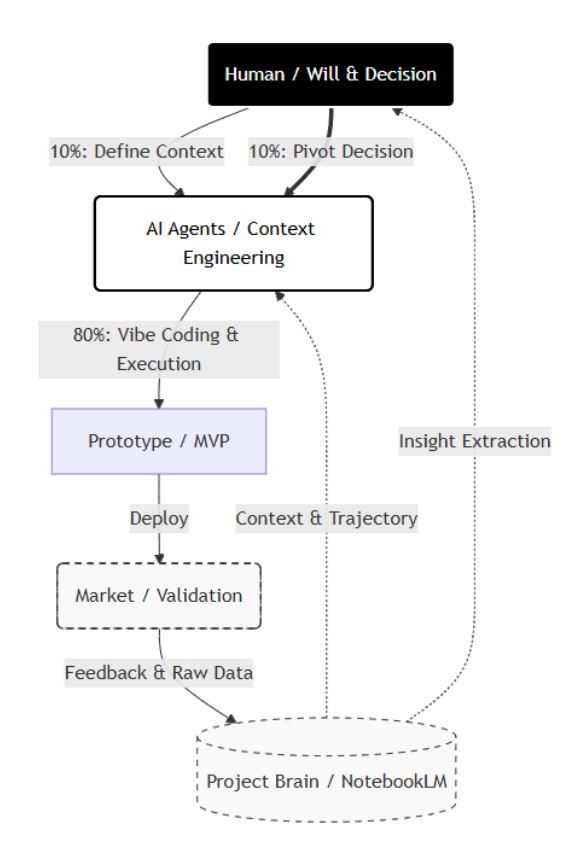

# Depth & Velocity: 生成AI時代の新規事業開発論

> **"Logic implies, Emotion drives."**
> （論理は示唆するが、感情だけが人を動かす）
 

## Introduction: 生成AI時代の新規事業開発とは？

生成AI時代における新規事業の本質は変わりません。 
新規事業開発は"人の営み"であり続けます。 
「意思決定（Decision）」と「熱量（Will）」はMUST要件です。 

しかし、従来の新規事業開発——市場調査に時間をかけ、PowerPointで完璧な計画を作り、承認を得てから開発を始めるスタイル——は、もはや「遅すぎる」のではなく「間違っている」のです。 

私たちは、新しいオペレーティング・システム（OS）を必要としています。 
それが「"Depth & Velocity"（深さと速度）」です。 

## 1. The Core Concept: 「10:80:10の法則」

AI時代のワークフローは、人間とAIの役割を完全に再定義します。 
私はこれを人とAIの共創黄金比 **「10:80:10の法則」** と呼びます。

### The First 10%: The Will（意志と問い）
* **担当:** 人間
* **役割:** 「なぜやるのか？」「誰のためにやるのか？」という根源的な問い（Deep Will）を立てること。
* ここにはAIは介在できません。狂気にも似た個人の熱量だけが、プロジェクトの初速を生みます。

### The Middle 80%: The Acceleration（加速と具体化）
* **担当:** AIエージェント
* **役割:** 調査、分析、コーディング、プロトタイピング、検証。
* 従来、人間が数ヶ月かけていたこのプロセスを、AIは数時間〜数日で圧縮します。人間はこのフェーズで手を動かしてはいけません。AIを指揮（Orchestrate）するのです。

### The Last 10%: The Decision（決断と責任）
* **担当:** 人間
* **役割:** 出来上がったものを世に出すか否かの最終判断。倫理的責任。
* AIは選択肢を提示しますが、問いに対する答えを見いだすのは常に私たち人間なのです。

  

## 2. The Architecture: Project Brain（プロジェクト脳）

AI時代に必要なのは、**「コンテキスト（文脈）の管理」** です。 
私たちに必要なのは新規事業開発プロセスの全てを記憶する **Project Brain** です。

### "Brain" Architecture
私たちは、プロジェクトごとに **「Project Brain（プロジェクト脳）」** を構築すべきです。 
新規事業開発のプロセスはブラックボックス化しています。 
正解や事例などはありません。常に仮説・問いを立てて検証し、ピポットを繰り返す。 
その活動の中で、起案者自らでさえ、プロジェクト開始時の記憶を鮮明に覚えていることなど困難です。

1.  **Input Everything:**
    * 会議（内部MTG、経営報告MTGなどあらゆるMTG）の音声文字起こしデータ
    * ホワイトボード（Miro）の殴り書きで描かれたイメージ図
    * ユーザーインタビューの音声文字起こしデータ
    * 競合分析、コンセプト設計、市場規模算出など、あらゆる中間成果物
    * これら全てをそのまま「Project Brain（NotebookLM）」にアップロードします。

2.  **Context, Not Tasks:**
    * AIは、この膨大なログから「文脈」を理解します。
    * 新規事業開発の全ての履歴を１次情報としてデータベース化するのです。
    * このデータベースは新規事業開発チームの"羅針盤"であり"Project Brain"になります。
    * どのように活用するのか？
    * ・「なぜ今の事業アイデアにたどり着いたのか、最初の起点から現在までの変遷を整理して」
    * ・「このユーザーインタビューで重要なインサイトは何か？その理由も教えて」
    * ・「新しいメンバーにオンボーディング資料を作って」
    * ・「経営層から指摘された重要論点を優先度順に並べて。そしてその際に言及されたコメントも添えて欲しい。」
    * ・「先週の議論を踏まえて、この機能の仕様書を書いて」
    * と指示するだけで、AIは阿吽の呼吸でアウトプットを出します。
    * 新規事業開発プロセスを全て記憶する「Project Brain」が全ての拠り所として機能します。

  

## 3. The Strategy: Prototype Driven（動くプロトタイプで右脳モードに）

イントレプレナーの新規事業が失敗する最大の理由は、承認者である経営層に対して、 
**「左脳（論理）」だけで新規事業のマインドセットを持たない経営増を説得しようとするから**です。 
企業の経営層は、何十年も既存事業の中で成功を積み重ねてきたプロフェッショナル達です。 
しかし彼らは、新規事業が必要であることは分かっていつつも、 
どうしても長年蓄積されて既存事業のマインドセットで新規事業を判断してしまいます。 
「左脳（論理）」に加えて、動くプロトタイプを見せて、触らせて「右脳（情緒）」モードをONにするのです。

### Left Brain Trap（左脳の罠）
* PowerPoint、収支計画書、市場調査レポート、競合優位性、
* これらは「Noと言う理由」を探すための材料にしかなりません。
* 論理は防御には役立ちますが、攻め（新しい事業案）には無力です。

### Right Brain Breakthrough（右脳の突破口）
* **"Show, Don't Tell."（語るな、見せろ）**
* 会議室に持ち込むべきは、プレゼン資料だけではありません。**「動くプロトタイプ」** が必要です。
* AI時代の前は、起案者はプロトタイプを開発するのに、エンジニアを動かすリソースを確保する承認が必要で、
* エンジニアが開発するプロトタイプが完成するまで待つ必要がありました。
* そして、作りあがったプロトタイプは、自分のイメージと異なるものが出来上がる**認識齟齬**が発生していました。
* **バイブコーディング** により、エンジニアの工数をかけることなく、
* 起案者自らがイメージ通りに動作するアプリを簡単に作れる時代が到来しました。
* スマホで実際に動く画面を見せた瞬間、会議の空気は「批評」から「共感」へ、
* そして改善アイデアを積極的に発言する「新規事業の伴走者」に変わります。

  

## Conclusion: Build to Think「作りながら考える」

* 考えながら作るのではなく、**「作りながら考える」** 時代です。
* 圧倒的な**速度で仮説検証**を回し続け、その中から人間だけが到達できる**本質**を見つけ出す。

これが、生成AI時代の新規事業開発論です。

  

---

## Author & Maintainer
**Satoshi Yamauchi** (山内 怜史) 
*(Business Desiger & AI Strategist at Sun*)* 
**[📒 Read my insights on Note](https://note.com/satoshi_yamauchi).** 
*(Founder / AI Strategist at Leading.AI)* 
This project is part of the research by Leading.AI. 
**[🌐 Visit Leading.AI Official Website](https://www.leading-ai.io/)** 
*(For consulting inquiries and strategic partnership)* 

---
