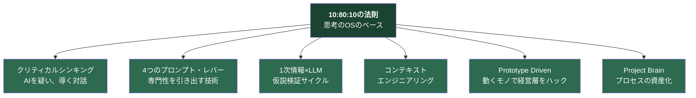
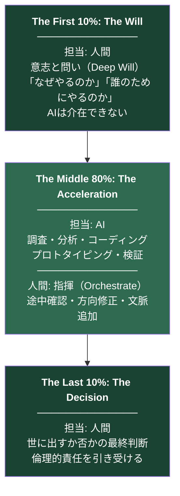
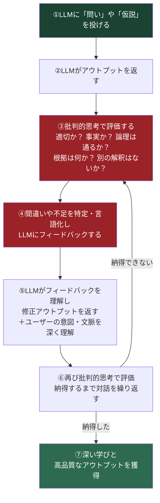
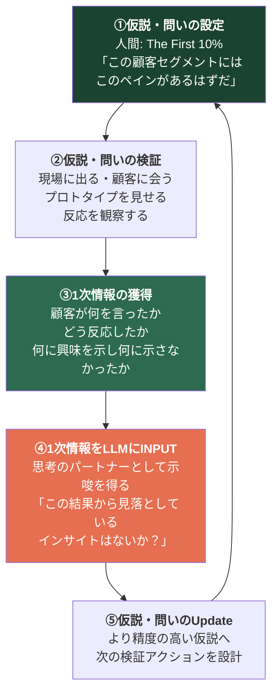
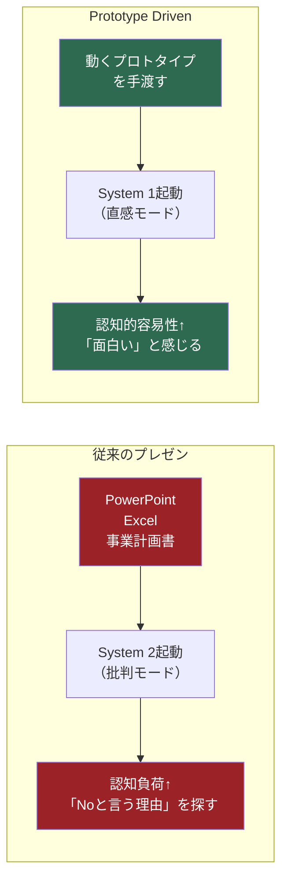
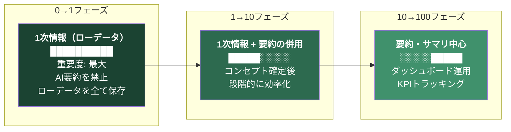
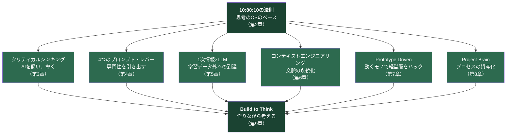

# Depth & Velocity: 生成AI時代の新規事業開発論

> **"Logic implies, Emotion drives."**
> （論理は示唆するが、感情だけが人を動かす）

<p align="center">
  
  <a href="http://creativecommons.org/licenses/by/4.0/"></a>
  
</p>

<p align="center">
  
</p>

---

# 第1章: Introduction — なぜ新しいOSが必要なのか

生成AI時代における新規事業の本質は変わらない。

新規事業開発は"人の営み"であり続ける。「意思決定（Decision）」と「熱量（Will）」はMUST要件だ。どれだけAIが進化しても、「なぜこの事業をやるのか」「誰のためにやるのか」という問いに答えるのは、人間だけだ。

しかし、従来の新規事業開発——市場調査に時間をかけ、PowerPointで完璧な計画を作り、承認を得てから開発を始めるスタイル——は、もはや「遅すぎる」のではない。**「間違っている」**のだ。

## 従来の新規事業開発が抱える構造的問題

大企業の新規事業開発は、4つの構造的問題を抱えている。

**問題1: 検証の遅さ。** アイデアからプロトタイプ完成までに数ヶ月。その間に市場環境は変わり、顧客のニーズも変わる。出来上がった時には、仮説そのものが古くなっている。ビジネス要件をエンジニアに伝え、実装してもらう過程で「認識のズレ」が発生し、完成したプロトタイプが起案者のイメージと異なるものになる。修正を依頼すれば、さらに数週間が失われる。そしてようやく完成したプロトタイプを持って顧客に会いに行くと、「ああ、それはもう別のサービスが出ていますよ」と言われる。

**問題2: プロセスのブラックボックス化。** 新規事業開発のプロセスは、起案者の頭の中にしか存在しない。過去の検討経緯、棄却されたアイデア、方向転換の理由。これらは議事録にもPowerPointにも残らない。残っているのは、綺麗に整えられた「議事録」と、結果だけが記された「PowerPoint」だけだ。そこには、チームがなぜ悩み、なぜ苦しみ、なぜその決断に至ったのかという「文脈（コンテキスト）」が一切残されていない。チームメンバーが変わるたびに、同じ説明をゼロから繰り返す。プロジェクトが凍結・解散すると、その文脈は永遠に失われ、次の新規事業開発チームはまた同じ議論を繰り返し、同じ落とし穴に落ちる。

**問題3: 経営層との構造的摩擦。** 経営層は既存事業で成功してきたプロフェッショナルだ。彼らは自社の既存事業で圧倒的な成果を出し、組織内の競争を勝ち抜いてきた。それは誰にでもできることではなく、リスペクトに値する。だが、彼らは過去何十年の成功体験によって、「既存事業のロジック」に思考回路が最適化されている。スポーツに例えるなら、彼らは「野球（既存事業）」の達人だ。打率や防御率で評価される世界で勝ってきた。一方、新規事業は「サッカー」だ。ルールも違えば、使う筋肉も、評価軸も全く異なる。この全くルールの異なるゲームを、既存事業のフォーマット——事業計画書、PowerPoint、Excelの収支計画——に乗せて説明しようとすると、構造的な摩擦が生じる。彼らは意地悪をしているわけではない。無意識のうちに、自分たちが熟知している「既存事業の成功体験」で新規事業をジャッジしてしまうのだ。

**問題4: ナレッジの消失。** プロジェクトが凍結・解散すると、チームが学び、経験し、得た知見も組織から失われる。次の新規事業チームは、同じ議論を繰り返し、同じ落とし穴に落ちる。組織は新規事業の「失敗」から学ぶことができない。なぜなら、「なぜ失敗したのか」のプロセスが記録されていないからだ。記録されているのは「このプロジェクトは中止になりました」という結果だけだ。

これらの問題は、個人の能力不足ではない。**新規事業開発の「OS（オペレーティング・システム）」が古い**のだ。

## 新しいOS: Depth & Velocity

私たちに必要なのは、新しいOSだ。それが**「Depth & Velocity（深さと速度）」**である。

従来の新規事業開発は「広く浅く」探索し、最も確率の高そうな1つに絞り込むアプローチだった。D&Vは逆だ。**「深く速く」**掘り進める。

AIをレバレッジとして使い、思考の深さ（Depth）と実行の速度（Velocity）を同時に達成する。この2つは従来、トレードオフの関係にあった。深く考えれば遅くなり、速く動けば浅くなる。AIがこのトレードオフを解消した。

2024年に実施された総務省のリサーチ結果によると、日本企業で生成AI活用方針を策定済みなのはわずか42.7%にとどまり、米国78.7%・ドイツ80.6%・中国95.1%と最大約50ポイントの差が開いている。マサチューセッツ工科大学の研究では、生成AIを使用すると、それを使用しない労働者と比較して、高度なスキルを持つ労働者のパフォーマンスが40%近く向上すると発表されている。米国の全国調査によると、生成AIを仕事で利用する労働者は、平均して労働時間の5.4%（週40時間勤務の場合、約2.2時間）を節約できていると回答している。

これらの数字は、AIが「便利なツール」ではなく「競争優位の源泉」であることを示している。D&Vは、このAIの力を新規事業開発に最適化された形で引き出す方法論だ。

D&V方法論は、以下の7つの構成要素から成る。



最上位に位置する「10:80:10の法則」が思考のOSのベースであり、残りの6つはその上で動くアプリケーションだ。本書では、この7つを順に解説し、最後に「Build to Think（作りながら考える）」という哲学で全体を統合する。

### 引用

1. 総務省「国内外における最新の情報通信技術の研究開発及びデジタル活用の動向に関する調査研究」（2024） — 日本企業の生成AI活用方針策定率42.7%
   https://www.soumu.go.jp/johotsusintokei/whitepaper/ja/r06/pdf/n1510000.pdf

2. MIT Sloan「How Generative AI Can Boost Highly Skilled Workers' Productivity」 — 生成AI使用で高度スキル労働者のパフォーマンスが40%向上
   https://mitsloan.mit.edu/ideas-made-to-matter/how-generative-ai-can-boost-highly-skilled-workers-productivity

3. Federal Reserve Bank of St. Louis「Impact of Generative AI on Work Productivity」（2024） — 生成AI利用労働者は週平均2.2時間を節約
   https://www.stlouisfed.org/on-the-economy/2025/feb/impact-generative-ai-work-productivity

---

# 第2章: 10:80:10の法則 — 人とAIの共創黄金比

AI時代のワークフローは、人間とAIの役割を完全に再定義する。

私はこれを人とAIの共創黄金比**「10:80:10の法則」**と呼ぶ。この比率は、D&V方法論の全てを貫く思考のOSのベースだ。AIは「代替」ではなく、人間の思考と能力を拡張させる「武器」である。問いを与えて、中間のアウトプットプロセスをAIに委ね、最後の意思決定を人間が担うことで、成果の質と量は最大化される。

## The First 10%: The Will（意志と問い）

**担当: 人間**

最初の10%は、人間にしかできない仕事だ。

「なぜやるのか？」「誰のためにやるのか？」という根源的な問い（Deep Will）を立てること。ここにはAIは介在できない。狂気にも似た個人の熱量だけが、プロジェクトの初速を生む。

AIは過去のデータから「確率的に最も妥当な答え」を生成する。だが、新規事業の初速を生むのは「確率的に最も妥当な答え」ではない。「これをやらなければ気が済まない」という個人の執念だ。

リーンスタートアップは「Build-Measure-Learn」のサイクルを説く。デザインシンキングは「共感」から始まる。だが、そのサイクルを回し始める最初の一歩——「なぜこの問題に取り組むのか」——を定義するのは、フレームワークではない。人間の意志だ。

この10%を他人に委ねた瞬間、あるいはAIに委ねた瞬間、プロジェクトは「誰のものでもない企画」になる。経営層に「で、あなたはなぜこれをやりたいの？」と聞かれた時、AIが生成した回答を読み上げる起案者を、誰が信じるだろうか。

## The Middle 80%: The Acceleration（加速と具体化）

**担当: AIエージェント**

中間の80%は、AIが圧倒的な速度で処理する。

調査、分析、コーディング、プロトタイピング、検証。従来、人間が数ヶ月かけていたこのプロセスを、AIは数時間〜数日で圧縮する。

ここで重要なのは、人間はこのフェーズで「手を動かしてはいけない」ということだ。AIを**指揮（Orchestrate）**するのだ。自分でコードを書くのではなく、AIに書かせる。自分で市場調査レポートを作るのではなく、AIに構造化させる。自分でプロトタイプをデザインするのではなく、AIに生成させる。

ただし、「AIに丸投げする」のではない。80%の中にも、人間の介入ポイントが複数存在する。AIの出力を途中で確認し、方向を修正し、追加の文脈を与える。AIが正規分布の中央に引き戻されそうになったら、プロンプト・レバーで専門領域に再誘導する（第4章で詳述）。

NVIDIAのジェンスン・フアンCEOは「年収にして50万ドルのエンジニアが、年末までにその半分のトークンを消費していなければ、深く憂慮する」と発言した。この発言の本質は、AIを使い倒すことそのものではない。**人間が最初の10%で定義した方向性に沿って、AIに80%の作業を高速で実行させることの価値**を認識しているということだ。

## The Last 10%: The Decision（決断と責任）

**担当: 人間**

最後の10%は、再び人間の仕事だ。

出来上がったものを世に出すか否かの最終判断。倫理的責任。AIは選択肢を提示するが、問いに対する答えを見いだすのは常に人間だ。

AIは「このプロトタイプの市場受容性は推定68%です」と言う。だが、「68%の確率に賭けて、リソースを投入するか否か」を決めるのは人間だ。そして、その決断の結果に責任を引き受けるのも人間だ。

AIは責任を取れない。責任を取れるのは、最初の10%で「なぜやるのか」を定義した人間だけだ。

ハーバード・ビジネス・スクールの研究チームが発表した論文「Navigating the Jagged Technological Frontier」では、AIの能力の境界線が「ギザギザな形状（Jagged Frontier）」であることが示されている。AIが人間より優れている領域と劣っている領域が明確に存在する。AIのフロンティアの内側（AIが得意）のタスクでは、AIを使うことで大幅にパフォーマンスが向上する。一方、フロンティアの外側（AIが苦手）のタスクでは、AIを使わなかった人間の方がパフォーマンスが高い。

10:80:10の法則は、このジャグドフロンティアを前提に設計されている。最初の10%（意志と問い）と最後の10%（決断と責任）は、AIのフロンティアの外側にある。中間の80%（調査・分析・実装）は、AIのフロンティアの内側にある。人間とAIが、それぞれの得意領域を最大限に活かす設計だ。



## なぜ「10:80:10」なのか

この比率は、新規事業開発に限らず、AI時代のあらゆる知的労働に適用できる。

今まで私たちは「量と質というアウトプットはトレードオフの関係にある」と考えてきた。だが、AI時代に人類史上初めて「量と質はAIにより両立できる関係になる」ことが証明された。

AIを24時間365日、思考のパートナーとして使い、自分の作業と並行してAIエージェントを動かすワークスタイルを実現している人は、AIを全く使わない人のアウトプットを、2倍にするのではなく、3倍、5倍、10倍にしていく。

10:80:10の法則は、この両立を実現するための設計原則だ。最初と最後の10%で人間が「質」を担保し、中間の80%でAIが「量」を圧縮する。結果として、深さ（Depth）と速度（Velocity）が同時に達成される。

Elon Musk氏はNeuralink社を通じて「AIを脳の追加機能・新しいレイヤーとして統合する」ビジョンを提唱している。10:80:10の法則は、ハードウェアを埋め込まずとも、ソフトウェアレベルで「AIを脳の拡張機能として統合する」ための実務的な設計図だ。

### 引用

1. HBS「Navigating the Jagged Technological Frontier」 — AIの凸凹な能力フロンティア
   https://readwise-assets.s3.amazonaws.com/media/wisereads/articles/navigating-the-jagged-technolo/24-013_8f3583c2-2e9a-4379-9697-a93bd6a84133.pdf

2. Bill Gates「The Age of AI Has Begun」（2023年3月）
   https://www.gatesnotes.com/The-Age-of-AI-Has-Begun

3. Jensen Huang / NVIDIA — 「Software is eating the world, but AI is going to eat software」
   https://www.technologyreview.com/2017/05/12/151722/nvidia-ceo-software-is-eating-the-world-but-ai-is-going-to-eat-software/

4. Martin Casado / Andreessen Horowitz — 「Generative AI Brings Cost of Creation Close to Zero」
   https://www.wsj.com/articles/generative-ai-brings-cost-of-creation-close-to-zero-andreessen-horowitzs-martin-casado-says-58e061b4

5. Elon Musk / Neuralink — AIを脳の追加レイヤーとして統合するビジョン
   https://techcrunch.com/2017/04/20/elon-musks-neuralink-wants-to-turn-cloud-based-ai-into-an-extension-of-our-brains/

---

# 第3章: クリティカルシンキング — AIを「疑い、導く」対話のプロセス

10:80:10の法則を実装する上で、最初に身につけるべきスキルがある。それは**クリティカルシンキング（批判的思考）**だ。

なぜクリティカルシンキングが最初に来るのか。理由は単純だ。AIの出力を正しく評価できなければ、10:80:10の法則は機能しない。中間の80%でAIが出したアウトプットを、最後の10%で人間が判断する。その判断の質を決めるのが、クリティカルシンキングだ。

## LLMの動作原理を理解する

大規模言語モデル（LLM）——ChatGPT、Gemini、Claude——が私たちの入力に対して回答を返すまでに、内部では5つのステップが実行されている。

**STEP①: トークン化。** 入力された文章を最小データ単位である「トークン」に分割する。日本語の場合、1文字が1トークンとは限らない。漢字は1〜2トークン、ひらがなは1トークン程度だ。大学生がレポートをひとつ（約7,000文字）をAIに書かせると、約1万トークンを消費する。

**STEP②: ベクトル化。** トークンをN次元のベクトル（数値の配列）に変換する。「犬」と「猫」はベクトル空間上で近い位置に、「犬」と「経済学」は遠い位置に配置される。これにより、言葉の意味的な関係性が数学的に表現される。

**STEP③: データ特徴理解。** ニューラルネットワーク（Transformerアーキテクチャ）を用いて、数値化されたデータの特徴を掴む。2017年6月、Googleの研究者チームが「Attention Is All You Need」という論文でTransformerアーキテクチャを提唱した。この概念がLLMの基盤技術となり、後続のGPT、Gemini、Claudeの全てに多大な影響を与えた。Transformerの核心は「自己注意機構（Self-Attention）」であり、入力文中の全てのトークン間の関係性を同時に計算する。「私は犬を公園で散歩させた」という文で、「散歩させた」が「私」と「犬」の両方に関係していることを、Self-Attentionが捉える。

**STEP④: 文脈理解。** STEP③で特徴を理解したデータを元に、文章全体の意味と文脈を理解する。単語単位ではなく、文章全体の構造と意図を把握する。

**STEP⑤: デコード。** 出力用のデータに変換して文章を出力する。ここが最も重要なステップだ。デコード処理では、ベクトルデータを変換し、**最も確率が高い単語やフレーズを選択する**ことで、人間が理解できる自然な回答を作成する。

| STEP | 処理 | 内容 |
|:---|:---|:---|
| ① | トークン化 | 入力文章を最小データ「トークン」に分割 |
| ② | ベクトル化 | トークンをN次元ベクトルに変換、意味的関係性を数値化 |
| ③ | データ特徴理解 | Transformer（Self-Attention）で全トークン間の関係を計算 |
| ④ | 文脈理解 | 文章全体の構造と意図を把握 |
| ⑤ | デコード | **確率的に最も妥当な次の単語を選択し、文章を生成** |

STEP⑤のデコード処理が本質を握っている。LLMは「正しい答え」を探しているのではない。「統計的に最も出現確率が高い次の単語」を選び続けているだけだ。

**LLMは思考しているわけではない。「統計学的な予測」と「確率論」で言葉を紡いでいくマシンである。**

「良い・悪い」「正しい・間違い」という判断基準を持たない。だから、ハルシネーション（事実と異なる出力）を防ぐことは原理的に不可能だ。極めて流暢に、極めて自信たっぷりに、完全な嘘を出力する。そして、それが嘘であることをLLM自身は認識していない。

## クリティカルシンキングとは何か

クリティカルシンキング（批判的思考）とは、前提や思い込みを鵜呑みにせず、「本当にそうか？」と問い直しながら、根拠と論理に基づいて物事の本質と妥当な結論を見極める思考法である。

日本語圏ではグロービス経営大学院が2012年に出版した「クリティカル・シンキング」が最も広く参照される体系書だ。ビジネスにおけるクリティカルシンキングの重要性は以前から認識されていたが、AI時代にその重要性は桁違いに高まった。

なぜか。AIの出力は、非常に流暢で、論理的に見え、説得力がある。だからこそ危険だ。流暢な文章を読んだ瞬間、人間の脳は「これは正しい」と直感的に判断する傾向がある。これはダニエル・カーネマンが指摘する「認知的容易性（Cognitive Ease）」のバイアスだ（第7章で詳述）。

生成AIの出力は品質が高いことも多い。品質の高い情報から、優れたアウトプットが出されることも多い。だが、その回答に真実の保証はない。そして生成AIのアウトプットを信じてしまうと、その瞬間に思考停止する癖がついてしまう。一度思考停止の癖がつくと、真実を含むアウトプットを得ることも出来なくなる。

## 「疑い、導く」対話のプロセス

AIとの正しい対話プロセスは、一方通行のQ&Aではない。**反復的な「疑い、導く」サイクル**だ。



このプロセスの核心は、**人間がAIを「導く」立場にある**ということだ。AIは優秀な部下のようなものだ。指示に対して全力で応えるが、指示の質が低ければアウトプットの質も低い。間違いを指摘されれば即座に修正する。だが、自分から「この指示はおかしいのでは？」とは言わない。

批判的に評価し、フィードバックを与え、方向を修正する。この「疑い、導く」プロセスを繰り返すことで、2つのことが同時に起きる。

**1つ目:** AIのアウトプットの品質が向上する。フィードバックを何度ももらうことで、AIはユーザーの意図や文脈を深く理解し、改善されたアウトプットを生成する。

**2つ目:** 人間自身の思考が深まる。AIに「なぜそう考えるのか？」と問い、その回答を批判的に検証する過程で、人間は自分自身の前提や思い込みに気づく。AIとの対話は、自分自身との対話でもある。

現在のテクノロジーが提供されている「形態」は、不気味なほどにシンプルだ。それはただの空白の入力チャットボックスであり、点滅するカーソルがあなたを見つめながら「今日は何かお手伝いしましょうか？」と問いかけてくるだけだ。その形態はあまりにシンプルがゆえに、人々はGoogleやBingの検索ボックスと同じように捉えてしまう誘惑に駆られる。しかしそれは、リサーチアシスタントやゴーストライター、あるいはコンサルタントを雇っておきながら、「外の天気はどうだい？」と尋ねているようなものだ。

### 引用

1. Vaswani et al.「Attention Is All You Need」（2017） — Transformerアーキテクチャの提唱
   https://arxiv.org/abs/1706.03762

2. グロービス経営大学院「クリティカル・シンキング」（2012）
   https://amzn.asia/d/hHp87To

3. Sol Rashidi「AI First: The Playbook for a Future-Proof Business and Brand」
   https://amzn.asia/d/dxoGKEf

4. Daniel Kahneman「Thinking, Fast and Slow」— 認知的容易性（Cognitive Ease）
   https://www.nobelprize.org/prizes/economic-sciences/2002/kahneman/lecture/

---

# 第4章: 4つのプロンプト・レバー — 「平均」から専門性を引き出す技術

2026年1月時点で、主要なLLM（ChatGPT、Gemini、Claudeなど）はインターネット上にある全てのオープンデータを学習済みだと言われている。

この事実は、2つのことを意味する。

**1つ目:** LLMは、人類がオープンに公開した知識の総体にアクセスできる。これは途方もない能力だ。

**2つ目:** 指示が曖昧なままLLMに質問を入力すると、統計的に最も出現頻度の高い「平均的な回答」が出力される。正規分布曲線の中央のボリュームゾーンの答えだ。LLMは一般的な知識を多く学習しているため、平均的な情報が使われる可能性が高い。

ビジネスにおいて価値があるのは、誰もが思いつく「平均的な正解」ではない。正規分布曲線の両端にある、希少性が高く、鋭い洞察を含んだ「プロフェッショナルの知見」だ。

コンピュータ科学の古典的格言に**「Garbage In, Garbage Out」**がある。入力がゴミなら出力もゴミになる。生成AIでも同じだ。曖昧な入力からは、曖昧な出力しか返らない。


## 4つのレバーで専門領域へシフトさせる

LLMの特性を理解した上で、4つの意図的な技術（レバー）を組み合わせることで、LLMの探索範囲を「平均」から「専門領域（マイノリティ）」へと強制的にシフトさせる。

### レバー1: 役割の定義（Role Definition）

LLMに専門家としての役割を明確に定義する。

- 「あなたは世界トップクラスの戦略コンサルタントです」
- 「UXデザインのプロフェッショナルとして回答してください」
- 「〇〇分野の第一人者として、批判的な視点でレビューしてください」

役割を定義することで、LLMの応答分布が「一般知識の中央値」から「指定された専門領域の知識」へシフトする。これは「プロンプトのコツ」ではなく、LLMの動作原理（第3章）に基づいた構造的な技術だ。LLMがデコード処理で次の単語を選択する際、役割定義によって「戦略コンサルタントが使う語彙と論理構造」の確率が上がり、「一般的な回答」の確率が下がる。

### レバー2: 思考プロセスの明示（Chain of Thought）

いきなり答えを出させず、手順を踏ませる。

- 「ステップバイステップで考えてください」
- 「まず背景を分析し、次に課題を洗い出し、最後に解決策を提示してください」
- 「結論を出す前に、反論を3つ考えてください」

思考プロセスを明示することで、LLMの推論が浅い連想ではなく、構造的な分析に基づくものになる。Wei et al.（2022）の研究「Chain-of-Thought Prompting Elicits Reasoning in Large Language Models」では、思考の連鎖を促すプロンプティングがLLMの推論能力を大幅に向上させることが実証されている。

### レバー3: 事例の提示（Few-Shot Examples）

「良い出力例」と「悪い出力例」を具体的に見せる。

- 「以下のような粒度とトーンで回答してください（例：〇〇〇）」
- 「一般的な回答例（悪い例）□□□ではなく、より専門的な分析を求めています」
- 「前回の出力で良かった点は△△△です。この品質を維持してください」

事例を提示することで、LLMは「期待される出力の品質水準」を理解し、その水準に合わせた応答を生成する。Brown et al.（2020）のGPT-3論文「Language Models are Few-Shot Learners」で、Few-Shot学習がLLMの能力を引き出す上で極めて有効であることが示された。

### レバー4: 制約の付与（Constraints）

出力の範囲を限定することで、焦点を絞る。

- 「300字以内で、最も重要な3点に絞って回答してください」
- 「日本市場に限定して、直近6ヶ月のデータに基づいて分析してください」
- 「技術的な詳細は省き、経営者が理解できる言葉で説明してください」
- 「ポジティブな面だけでなく、リスクと懸念点も必ず含めてください」

制約を与えることで、LLMは広範な知識の中から、指定された条件に合致する部分だけを抽出して応答する。制約がないと、LLMは「関連しそうなことを全て含める」傾向があり、結果として焦点がぼやける。

## 4つのレバーの組み合わせ

4つのレバーは単独でも効果があるが、**組み合わせることで効果が乗算的に高まる**。

| 組み合わせ | 効果 | 具体例 |
|:---|:---|:---|
| 役割のみ | 専門領域の知識にアクセス | 「戦略コンサルタントとして分析して」 |
| 役割 + 思考プロセス | 専門家が段階的に分析するような深い回答 | 「戦略コンサルタントとして、まず市場構造を分析し、次に競合ポジションを評価し、最後に参入戦略を提案して」 |
| 役割 + 事例 + 制約 | 特定の品質水準で、限定されたスコープの専門的回答 | 「McKinseyのパートナーとして、以下の粒度で、日本市場に限定して、3ページ以内で」 |
| **4つ全て** | **最も精度の高い、プロフェッショナルレベルの回答** | 全レバーを統合したプロンプト設計 |

これらの技術を使いこなせば、あらゆる領域のプロフェッショナルの知見を、必要な時に手に入れられる。彼らとの壁打ちを通じて、自分自身の考えを深めることで、LLMはあなたの新規事業の思考パートナーになる。あなただけの「最強の専門家チーム」を持つことが出来るのだ。

なお、ユーザーインタビューの前に一般消費者への受容性調査をAIで行う場合など、「平均的な回答」を意図的に狙うケースもある。その場合はレバーを外して、あえて一般的な応答を引き出す。レバーは常にONにするものではなく、目的に応じて使い分ける技術だ。

### 引用

1. Wei et al.「Chain-of-Thought Prompting Elicits Reasoning in Large Language Models」（2022）
   https://arxiv.org/abs/2201.11903

2. Brown et al.「Language Models are Few-Shot Learners」（2020） — GPT-3とFew-Shot学習
   https://arxiv.org/abs/2005.14165

3. Sol Rashidi「AI First: The Playbook for a Future-Proof Business and Brand」
   https://amzn.asia/d/dxoGKEf

---

# 第5章: 1次情報×LLMの仮説検証サイクル — 「学習データ外」への到達

LLMは、インターネット上の全てのオープンデータを学習している。これは途方もない知識量だが、決定的な限界がある。

**LLMが学習しているのは、世界中の誰かが書いた2次情報の集合体だ。**

新規事業開発において最も価値のある情報——あなたが見て、聞いて、感じて、触れることで得た**1次情報**——は、LLMの学習データには存在しない。AI時代においても、新規事業開発の本質は人の営みであることに変わりない。現場に足を運び、顧客と向き合い、プロトタイプを触ってもらい、その反応を自分の目で観察する。このプロセスで得た1次情報は、他の誰も持っていない最も希少で最も価値の高い情報だ。

## 1次情報こそが新規事業の鉱脈

| 情報の種類 | LLMの学習状況 | 新規事業における価値 | 取得方法 |
|:---|:---|:---|:---|
| インターネット上のオープンデータ | 学習済み | 一般的（差別化不可能） | 誰でもアクセス可能 |
| 業界レポート・学術論文 | 学習済み | 中程度 | 有料データベース |
| あなたが現場で得た1次情報 | **未学習** | **最も高い** | 現場での行動のみ |
| 1次情報に対するあなたの解釈 | **未学習** | **最も高い** | あなたの思考のみ |

LLMが学習済みの情報は「世界中の誰かが書いた2次情報の集合体」だ。インターネット上にある全てのオープンデータ。これは確かに途方もない知識量だが、全員が同じ知識にアクセスできるという意味で、差別化の源泉にはならない。

一方、あなたが見て、聞いて、感じて、触れることで得た1次情報——ユーザーインタビューで相手がふと漏らした一言、プロトタイプを触った瞬間の表情の変化、競合サービスを実際に使ってみた時の違和感——これらはAIが学習していない、誰も知らない価値のある情報だ。

## 仮説検証サイクルの設計

1次情報をLLMに投入し、思考のパートナーとして活用するサイクルを回す。このサイクルこそが、D&V方法論の実行エンジンだ。



**①仮説・問いの設定（The First 10%）:** 新規事業の仮説を立てる。「この顧客セグメントには、このペインがあるはずだ」「このソリューションなら、月額5万円払ってでも使いたいと言わせられるはずだ」。この問いの質が、サイクル全体の成果を決める。

**②仮説・問いの検証（現場での行動）:** 仮説を持って現場に出る。顧客にインタビューする。プロトタイプを見せる。反応を観察する。ここでは「確証バイアス」に注意が必要だ。自分の仮説を裏付ける情報だけを拾い集めるのではなく、仮説を否定する情報こそ積極的に集める。

**③1次情報の獲得:** 検証の結果、顧客が何を言ったか、どう反応したか、何に興味を示し何に興味を示さなかったか。これが1次情報だ。重要なのは、この1次情報を「要約」しないこと（第8章で詳述）。インタビューの文字起こしデータは、全文をそのまま保存する。

**④LLMへのINPUT:** この1次情報をLLMに投入する。「以下のインタビュー結果から、私たちの仮説の妥当性を評価してください。また、見落としている可能性のあるインサイトがあれば指摘してください」と問う。ここで第3章のクリティカルシンキングと第4章のプロンプト・レバーが活きる。LLMの出力を無批判に受け入れるのではなく、「疑い、導く」対話を通じて示唆を引き出す。

**⑤仮説のUpdate:** LLMの示唆を受けて、仮説を更新する。そして再び現場に出る。

このサイクルを高速で回すことで、LLMの学習データには存在しない「確度の高い仮説」が構築される。**LLMは地図を持っているが、あなたは地形を知っている。** 地図と地形の情報を組み合わせた時、最も精度の高いルートが見える。

## なぜこのサイクルが従来と根本的に違うのか

リーンスタートアップのBuild-Measure-Learnサイクルも、仮説検証の反復を説く。D&Vの1次情報×LLMサイクルが根本的に異なるのは、**検証と次の仮説設定の間にLLMが介在する**ことだ。

従来のサイクルでは、検証結果の解釈は人間の頭の中で行われていた。インタビュー10件の結果を、起案者が自分の経験と直感で解釈し、次の仮説を立てる。ここには起案者の確証バイアス、経験の偏り、認知の限界が介在する。

D&Vのサイクルでは、検証結果（1次情報）をLLMに投入する。LLMは、起案者が見落としたパターンや、起案者の専門領域外の知見から、新しい示唆を提示する。もちろん、その示唆も第3章のクリティカルシンキングで検証するが、**人間の認知の限界をAIが補完する**構造が生まれる。

### 引用

1. Eric Ries「The Lean Startup」（2011） — Build-Measure-Learnの仮説検証ループ
   https://theleanstartup.com/

2. Steve Blank「The Four Steps to the Epiphany」（2005） — 顧客開発モデルと1次情報の重要性
   https://steveblank.com/

3. HBS「Navigating the Jagged Technological Frontier」 — AIの得意領域と苦手領域の境界
   https://readwise-assets.s3.amazonaws.com/media/wisereads/articles/navigating-the-jagged-technolo/24-013_8f3583c2-2e9a-4379-9697-a93bd6a84133.pdf

---

# 第6章: コンテキストエンジニアリング — プロンプトから文脈へ

多くの人がAIを使う際、「プロンプトエンジニアリング」——1回の指示で望む結果を得るための技術——を重視する。精巧なプロンプトテンプレートを設計し、命令書、制約条件、入力文、出力文を整えて、100点の回答を期待する。

だが、新規事業開発においてプロンプトエンジニアリングには構造的な限界がある。

## プロンプトエンジニアリングの限界

プロンプトエンジニアリングは**「1-Shot（一発の指示）」で正解を出す方法**だ。

問題は、新規事業開発が「1-Shot」で正解が出る性質のものではないことだ。新規事業は、不確実性を伴い、変化し続け、文脈情報も変わっていく。今週の仮説は、来週のインタビュー結果で覆るかもしれない。先月の方向性は、今月の競合の動きで修正が必要になるかもしれない。

さらに、プロンプトエンジニアリングでは**アウトプットの再利用ができない**。プロンプトAで得たアウトプットの文脈を、プロンプトBに引き継ぐ仕組みがない。新しいチャットを開くたびに、文脈はゼロに戻る。プロンプトとアウトプットは常に1対1の関係であり、過去の対話で築いた文脈は次の対話に引き継がれない。

不確実性を伴い、変化し続ける、また文脈情報も変わっていく新規事業開発の中で、**柔軟性のないプロンプトエンジニアリングは使えない。**

## コンテキストエンジニアリングとは

「コンテキストエンジニアリング」の概念を初めて提唱したのは、米AIテック企業Cognition社の共同創業者、Walden Yan氏だ。過去情報を自動的に整理・伝播する仕組みづくりを指し、マルチAIエージェントを実行させるために必要不可欠な考え方として定義された。

Yan氏はこれを「AIエージェント同士」の連携に必要な概念と定義したが、**私はこれを「人間とAI」の共創関係にも拡張すべきだと考える**。

より一般的な概念として捉えると、新規事業開発の活動における文脈（コンテキスト）——これまでの検討経緯、獲得した1次情報、方針転換の理由、棄却されたアイデアとその理由——を構造的に管理し、LLMとの全ての対話に持ち込む。「新規事業開発の思考のプロセスや文脈を永続的に保持し、対話を通じて育て上げる」ことが重要だ。

これが、新規事業開発におけるコンテキストエンジニアリングだ。

## contextファイルの設計と運用

具体的な実装として、新規事業開発の文脈情報を記録する**contextファイル**を使う。contextファイルは、プロジェクトの「生きた記録」だ。

contextファイルの書き方に決まりはないが、以下に実用的な構造を示す。新規作成してしまえば、それ以降はプロジェクト活動を通じて生成AI（LLM）にUpdateさせていくことが可能になる。

```markdown
# contextファイル

**プロジェクト:** 中堅ゼネコン向け建設DX SaaS "Site-Log"（仮称）
**事業フェーズ:** 課題探索 / Problem-Solution Fit検証中（MVP未開発）
**更新日付:** 2026-01-28

## 1. プロジェクトの目的とゴール
- **直近の目標**: 2026年4月までに、「お金を出してでも解決したい」と
  断言してくれる現場を1つ見つけ、MVP開発の合意を得る。
  - *現状:* 15社の現場代理人にヒアリングしたが、「あったらいいけど、
    金は払わない」「今のやり方（紙・Excel）で回っている」と一蹴され続けている。
- **ターゲット**: 売上300〜500億円規模の中堅ゼネコン。
- **探索中のコアバリュー**: まだ「これだ！」という核が見つかっていない。
  当初の「残業削減」は響かなかった。今は「安全管理リスクの低減」か
  「図面管理」のどちらかに鉱脈があるのではないかと掘っている最中。

## 2. 現場の絶対的な制約条件
※変えられない前提条件
- **法的・契約上の制約**:
  - 「紙文化」の法的根拠: 役所提出書類の多くが「紙原本」必須。
    DXツールを入れても「紙出力→ハンコ」の作業が残るなら、
    現場にとっては「ただ仕事が増えるだけ」と見なされる。
- **物理・環境制約**:
  - デバイス環境: 現場には「共有の古いデジカメ」が1台あるだけ。
    iPad支給はまだ進んでいない現場が多い。
    「職人の個人のスマホを使わせる」提案は、通信費精算の問題で即却下された。
  - ネットワーク: 地下や山間部は圏外。
    クラウド前提のツールは提案した瞬間に「使えない」と判断される。

## 3. 意思決定と発見したインサイト
※過去6ヶ月の活動で「何を作るべきか」を探して仮説と検証を繰り返した記録

### Phase 1: 「効率化」仮説の敗北（1-2ヵ月目）
- **[2025-08-10] 発見: 「残業削減」は魔法の言葉ではない**
  - *仮説:* 「事務作業を自動化して、早く帰りましょう」と提案すれば喜ばれるはず。
  - *事実:* 50代の現場所長に「確かに効率化できれば有難いが、事務作業は
    その日の現場作業を見直す重要な業務が存在する。それを自動化すること
    自体がナンセンスだ」と言われた。
  - *インサイト:* 「事務作業自動化」は本社の論理であり、現場が考える
    「事務作業で自動化できないものがある」というリアルな声を把握できていなかった。

- **[2025-09-05] 意思決定: 「日報自動化」アイデアの廃棄**
  - *アクション:* 音声入力で日報が自動作成されるモックアップを見せた。
  - *事実:* 「こんな精度の低い日報じゃ、万が一事故が起きた時に俺を守れない」と酷評。
  - *インサイト:* 彼らにとって日報は「報告」ではなく「事故が発生した時に
    自分を守るための証拠」。AIの精度の低い要約文章など、怖くて使えない。

### Phase 2: 「安全・品質」へのシフトと壁（3-4ヶ月目）
- **[2025-10-20] 発見: 書類作成自動化コンセプトの検証**
  - *事実:* 協力会社から集める安全書類の不備チェックに、毎月膨大な時間が割かれている。
  - *結果:* 競合（Greenfile.workなど）が既に普及。レッドオーシャンを確認して撤退。

- **[2025-11-15] 発見: 「写真整理」への原点回帰**
  - *事実:* 一番時間を食っているのは「デジカメの写真をPCに移し、Excelに貼り付ける」
    という超アナログ作業。
  - *仮説:* 既存ツールは「高機能すぎて使いこなせない」。逆に「デジカメのように使えるが、
    勝手に台帳ができる」レベルまで機能を削ぎ落とせば勝機があるか？

### Phase 3: 協力者探しと停滞（5ヵ月目-現在）
- **[2025-12-10] アクション: 「iPad支給」のハードル**
  - *結果:* 「会社のネットワーク（Wi-Fi）に、出所不明の端末は繋げられない」と
    本社の情報システム課にブロックされた。
  - *インサイト:* 建設現場はITセキュリティ要件が意外に高く、
    ハードウェアの持ち込み検証すら容易ではない。

## 4. 今、直面している「解決すべき」課題
- **課題 #01: 「キラーペイン」の不在**
  - *状況:* 「月額5万円払ってでも今すぐ欲しい」と言われるほどの
    強烈なペインが見つからない。「あったらいいな（Nice to Have）」止まり。
  - *問い:* 現場監督が「自腹を切ってでも隠れて使いたい」と思うほどの課題はどこにあるのか？

- **課題 #02: 本社と現場の温度差（ゲートキーパー問題）**
  - *状況:* 本社は「いいですね。試しましょう」と言うが、紹介された現場では
    「本社は現場を全く理解していない」と門前払い。
  - *仮説:* トップダウンではなく、現場のキーマン（所長）を
    直接口説き落とすボトムアップ戦略に変えるべきか？
```

このcontextファイルのサンプルは、実際のウェビナーで使用したデモシナリオに基づいている。注目してほしいのは、「仮説」「事実」「インサイト」「意思決定」が時系列で記録されている点だ。3ヶ月前に棄却したアイデアが、なぜ棄却されたのかの理由も記録されている。

## contextファイルの運用フロー

重要なのは、contextファイルを**常に最新化し続ける**ことだ。プロジェクト活動が進むにつれて、方針が変わり、新しい1次情報が入り、仮説が更新される。contextファイルはその全てを反映する。


contextファイルを各チャットの冒頭で読み込ませることで、LLMは**プロジェクトの全文脈を理解した状態で**対話を始める。新しいチャットを開いても、文脈はゼロに戻らない。contextファイルが文脈の永続性を担保する。

プロンプトエンジニアリングが「1回の指示で100点を狙う」アプローチだとすれば、コンテキストエンジニアリングは「文脈を積み重ねて、対話のたびに精度が上がっていく」アプローチだ。新規事業開発のように、答えが見えない中で仮説を磨き続けるプロセスには、後者のアプローチが圧倒的に適している。

### 引用

1. Walden Yan / Cognition「Context Engineering」 — コンテキストエンジニアリングの初出
   https://www.philschmid.de/context-engineering

2. Philipp Schmid「Context Engineering for AI Agents」
   https://www.philschmid.de/context-engineering

---

# 第7章: Prototype Driven — 動くモノで経営層をハックする

新規事業開発において、最も頻繁に繰り返される悲劇がある。

**起案者が魂を込めて作った事業計画書が、経営層の「既存事業のロジック」で却下される。**

この悲劇は、起案者の能力不足ではない。経営層の意地悪でもない。**認知科学的に説明可能な、構造的な問題**だ。本章では、ノーベル経済学賞受賞者ダニエル・カーネマンの理論を軸に、この構造を解剖し、「動くプロトタイプ」で突破する方法論を提示する。

## なぜ経営層は新規事業を却下するのか

企業の経営層は、自社の既存事業で圧倒的な成果を出し、組織内の競争を勝ち抜いてきたプロフェッショナルだ。それは誰にでもできることではなく、リスペクトに値する。

だが、彼らは過去何十年の成功体験によって、「既存事業のロジック」に思考回路が最適化されている。

スポーツに例えるなら、彼らは「野球（既存事業）」の達人だ。打率や防御率で評価される世界で勝ってきた。一方、新規事業は「サッカー」だ。ルールも違えば、使う筋肉も、評価軸も全く異なる。

| | 既存事業 | 新規事業 |
|:---|:---|:---|
| 行動原理 | 効率化 | 圧倒的な行動量 |
| 判断基準 | 前例踏襲 | 前例なし |
| ビジネスモデル | 成立済み | 模索中 |
| 環境 | 確実性 | 不確実性 |
| リスク | 最小化 | 恐れない |
| 成功指標 | KPIの達成 | 学びの獲得速度 |
| 時間軸 | 四半期〜年次 | 週次〜月次 |

この全くルールの異なるゲームを、既存事業のフォーマット——事業計画書、PowerPoint、Excelの収支計画——に乗せて説明しようとすると、構造的な摩擦が生じる。彼らは意地悪をしているわけではない。経営者として新規事業の重要さを十分理解している。既存事業の成長だけでは企業が勝ち残っていけないことに気付いている。それを理解しているにもかかわらず、無意識のうちに、自分たちが熟知している「既存事業の成功体験」で新規事業をジャッジしてしまう。彼らは自らの矛盾に気付いていない。だが、彼らの思考回路を突破しなければ、新規事業開発を前に進めることができない。愚痴をこぼしていても、新規事業は前に進まないのだ。

## ダニエル・カーネマンの二重過程理論

ノーベル経済学賞受賞者ダニエル・カーネマンの「二重過程理論（Dual Process Theory）」で、この構造を分析する。

人間の脳には、2つの思考モードがある。

| | System 1（速い思考） | System 2（遅い思考） |
|:---|:---|:---|
| 特性 | 直感的、感情的、自動的 | 論理的、批判的、意識的 |
| 認知負荷 | 低い | 高い |
| 例 | 「2+2」の計算 | 「17×24」の暗算 |
| 新規事業への態度 | 直感で「面白い」 | 論理で「リスクが高い」 |

馴染みのない新規事業の考え方を、熱意を持って分厚いプレゼンテーション資料で見せられた時、経営層の脳には強烈な**「認知負荷（Cognitive Load）」**が生じる。得意な「野球」の話ではなく、得意ではない「サッカー」の話をされている。馴染みのないルールや考え方、脳の使い方を強要されている。

脳がストレスを感じると、エネルギー消費を抑えようとする防衛本能として、強制的に**System 2（批判モード）**を起動させる。脳が警戒態勢に入り、目の前の情報を疑ってかかろうとする。忙しい経営陣が割いてくれた限られた時間の中で、変数が複雑に絡み合ったExcelの表を見せる。その瞬間、彼らのSystem 2は「Noと言う理由」を探し始める。

**これが、新規事業の企画が「野球のルールでサッカーをジャッジされる」認知科学的メカニズムだ。**

## 認知的容易性で右脳スイッチを入れる

カーネマンは別の概念も提唱している。**「認知的容易性（Cognitive Ease）」**だ。

人間の脳は「見えやすいもの・理解しやすいもの」を「真実であり、リスクが低い」と直感的に判断するバイアスがある。これは「真実性の錯覚」とも呼ばれる。

動くプロトタイプは、この認知的容易性を促す。PowerPointの文字列は抽象的だ。脳はそれを解読するためにSystem 2を酷使する。だが、スマホの画面を手渡して「タップしてみてください」と言えば、指先の操作という身体的経験を通じて、サービスの価値が直感的に理解される。



「動くもの」や「視覚的な情報」が、経営判断という高度なタスクにおいて、テキストや表よりも脳の理解を促す。動くプロトタイプは単なる機能説明ではなく、相手の脳を新しいアイデアを受け入れやすいモードへと切り替えるための、**認知科学に基づいたコミュニケーション戦略**だ。

## 身体性認知（Embodied Cognition）

認知科学には「身体性認知（Embodied Cognition）」という考え方がある。人間の認知は脳だけで完結するのではなく、身体的な経験と深く結びついているという理論だ。

Cangelosi & Stramandinoli（2018）の研究「A review of abstract concept learning in embodied agents and robots」でも、抽象的な概念（Abstract Concepts）は、言葉による説明よりも、具体的・身体的な経験を通じた説明の方がより深く理解されることが示唆されている。

「革新的なUX」と口で説明するよりも、実際にスマホを手渡し、指先でタップしてもらい、画面が遷移する様子を体感させる。**動くプロトタイプが、経営層の脳内に事業の価値をインストールする、最も解像度の高い情報伝達手段だ。**

## バイブコーディング — 最強の武器

ここで登場するのが**バイブコーディング（Vibe Coding）**だ。

OpenAI共同創業者で元Tesla AI責任者のAndrej Karpathy氏が自身のX上で初めて命名したこの手法は、「AIに自然言語で指示を出してコードを書かせる」新しいプログラミング手法だ。従来の「人間が細かくコードを書く」スタイルから根本的に転換する。

バイブコーディングが新規事業開発を根本から変える理由は2つある。

**理由1: 「考える人」が「作る人」になれる。** 従来は、ビジネス要件をエンジニアに伝え、実装してもらう過程で多くの「認識のズレ（Gap）」が発生した。プロトタイプ開発には最低1ヶ月、エンジニアのリソース確保に承認が必要だった。そして完成したプロトタイプは、起案者のイメージと異なるものになることが少なくなかった。バイブコーディングにより、「新規サービスを考える人」が「動くプロトタイプを開発する人」になる世界が到来した。起案者自らが数時間でイメージ通りに動作するアプリを作れる。

**理由2: 仮説検証サイクルが超高速化する。** 仮説を立てたら動くプロトタイプを作成し、そのまま顧客に受容性検証に持っていくサイクルを、新規事業担当者が全て担当できる。反応が悪ければ、その場で修正するか、潔く捨てて作り直す。思いついたアイデアを、昼までに動くプロトタイプにし、午後には顧客（あるいは上司）に見せる。AIによってプロトタイプ開発コストが極小化した今、「正解を見つけるために、大量に作って大量に捨てる」という真のアジャイル開発が可能になった。

既に様々なバイブコーディングツールが登場している。コードを書いたことがない方でも使いやすいサービスとして、Replit、bolt.new、Lovable、そしてClaude Codeがある。Anthropic社が発表した「Claude Code」の登場は世界的な衝撃として伝えられ、2026年初頭時点でClaude Codeが全公開GitHubコミットの4%を占め、年末までに20%超へ到達の見込みと分析されている。

ただし、Claude Codeがエンタープライズ級プロダクト（大規模・複雑・セキュリティ厳格なもの）で未成熟という指摘も存在する。ここで重要なのは、バイブコーディングの目的は「本番プロダクトの開発」ではなく、「仮説検証のためのプロトタイプの高速生成」だということだ。70%の完成度で十分なのだ。

## Wesselの「逆U字」の法則 — 完成させすぎない勇気

プロトタイプを経営層に見せる際、「完璧なものを見せなければ失礼だ」という思い込みが逆効果になる。

Wessellの研究によれば、クラウドファンディングにおいて「忠実度（Fidelity＝完成度）」と「資金調達成功率」の関係は逆U字カーブを描く。**中程度の忠実度（70%の完成度）が、最も高い成果を出す。**

なぜか。100%完成したプロトタイプを見せると、「これが完成したプロトタイプです。完璧に仕上げてきました。ご承認ください」と提示する。経営者は腕を組み、「審査員」の席に座り、粗探し（System 2）を始める。「ここの色がコーポレートカラーと違う」「このボタン配置は論理的ではない」といった、本質ではない指摘が始まる。

だが、70%の完成度で「コアとなる体験部分だけ実装したプロトタイプです。ただ、〇〇専務の視点から見て、この決済フローに違和感がないか、実際に触ってアドバイスをいただけないでしょうか？」と聞けば、状況は一変する。

## 保有効果で「敵」を「味方」に変える

もし経営層が「うーん、このサービスであれば、もっとこういう伝え方の方が良いんじゃないか？」と発言したら、それは大きなチャンスだ。

その瞬間、このプロトタイプは「担当者の企画」から「**その人の意見が入った企画（＝自分事）**」に変わる。

これは**「保有効果（Endowment Effect）」**の応用だ。人は「自分が所有しているもの」や「自分が関与したもの」に対して、客観的な価値以上の愛着や高い価値を感じる性質がある。この強力な心理効果を、経営層に向けたピッチの場に応用する。

動くプロトタイプに「自分の意見」が入った時、彼らはこの事業をより良くしようとする「当事者」になる。もしその場で修正できるような些細な指摘なら、その場でバイブコーディングで直して見せてもいい。「おっしゃる通りに変えてみました、どうですか？」と。バイブコーディングができるからこそ可能な、リアルタイムの共同制作体験だ。

### 引用

1. Daniel Kahneman「Thinking, Fast and Slow」 — 二重過程理論、認知的容易性
   https://www.nobelprize.org/prizes/economic-sciences/2002/kahneman/lecture/

2. Daniel Kahneman Nobel Lecture（2002） — 二重過程理論の学術的基盤
   https://www.nobelprize.org/uploads/2018/06/kahnemann-lecture.pdf

3. Cangelosi & Stramandinoli「A review of abstract concept learning in embodied agents and robots」（2018） — 身体性認知
   https://pmc.ncbi.nlm.nih.gov/articles/PMC6015819/

4. Andrej Karpathy — バイブコーディングの命名
   https://x.com/karpathy/status/1886192184808149383

5. Wessel et al.「The Role of Prototype Fidelity in Crowdfunding」Journal of Business Venturing（2022） — 逆U字の法則
   https://ideas.repec.org/a/eee/jbvent/v37y2022i4s0883902622000325.html

6. Anthropic「The Impact of Claude Code on Software Development」
   https://www.anthropic.com/research/impact-software-development

7. Claude Code — Anthropic公式
   https://claude.com/product/claude-code

---

# 第8章: Project Brain — プロセスの資産化

この章は、D&V方法論の中で最も独自性が高く、最も実務的なインパクトを持つ概念だ。

2026年3月に実施した客観的調査の結果、Project Brainは新規事業開発の方法論として**世界初**であることが確認された。既存の新規事業開発方法論——リーンスタートアップ、デザインシンキング、ジョブ理論、ビジネスモデルキャンバス——は、いずれも「何を作るか」「誰に届けるか」「どう検証するか」に焦点を当てている。**「プロセスそのものをどう記録し、資産として再利用するか」を方法論の核に据えたものは、Project Brainが初めてだ。**

## 新規事業開発の4つの構造的問題

新規事業開発の現場では、残っているのは綺麗に整えられた「議事録」と、結果だけが記された「PowerPoint」だけだ。そこには、チームがなぜ悩み、なぜ苦しみ、なぜその決断に至ったのかという「文脈（コンテキスト）」が、一切残されていない。プロジェクトが凍結・解散すると、その文脈は永遠に失われる。そして次の新規事業開発チームはまた、数ヶ月前と同じ議論を繰り返し、同じ落とし穴に落ちる。

新規事業開発の現場は「ピボットの連続」だ。正解のない問いに向き合い、日々膨大な仮説を立て、議論し、棄却し、また新しい仮説を立てる。そのプロセスには、凄まじい熱量と、無数の「思考の分岐点」が存在する。だが、その分岐点の記録は、どこにも残らない。

**問題1: ブラックボックス化。** 過去の検討経緯が、担当者の記憶の中にしかない。第三者が「どのような検討経緯を辿ってきたのか？」を知る術がない。プロジェクト発足から6ヶ月が経過し、その間に何十回もの会議を重ね、何度もピボットしてきた。だが、その軌跡を起案者以外の誰も辿ることができない。

**問題2: 起案者自身の記憶の劣化。** ピボットを繰り返す中で、起案者自身も「いつ、何が起こり、どういう方針変更を、なぜ行ったのか」の全体把握ができなくなる。人間の記憶は劣化する。3ヶ月前の会議で誰が何を言ったか、なぜA案ではなくB案を選んだか。起案者自身でさえ、正確に思い出すことはできない。

**問題3: オンボーディングの非効率。** 新メンバーが入るたびに、同じ説明をゼロから繰り返す。説明しても、起案者の想いや検討経緯、今まで活動してきたリアリティのある1次情報が伝わらない。新メンバーは「概要は分かったが、なぜ今の方向性になったのかが腑に落ちない」という状態で議論に参加することになる。その結果、既に検討済みの論点が蒸し返され、チーム全体の議論が後退する。

**問題4: ナレッジの消失。** プロジェクトが解散・凍結すると、今まで新規事業開発チームが学び、経験し、得られた知見も失われてしまう。社内の次の新規事業開発に、過去の知見が反映されないし、活かされない。「なぜ失敗したのか」のプロセスが記録されていないため、組織は同じ失敗を繰り返す。

## 「AI要約」という名の甘い罠

多くの新規事業チームが、これらの問題に対して間違った解決策を選んでいる。それは**「生成AIによる情報の要約」**だ。

- 会議が終わると同時に、Zoomの文字起こしをAI要約で見て、会議のサマリーだけを読む
- 何かをリサーチするときに、1次情報を読むのではなく「この資料のサマリを教えて」「要点だけ抽出して」とAIに依頼する
- ユーザーインタビューに参加できなかったとき、インタビューのサマリだけを教えてもらう

新規事業開発は、膨大な情報で溢れている。情報疲れをしている。情報は集めれば集めるほど、それを解釈する行為に負担がかかる。私たちはつい、AIを用いてなるべく脳の負担を軽減しようとする。

**しかし、断言する。新規事業開発の0→1フェーズにおいて、安易な「AI要約」に頼ることは、絶対に避けなければいけない行為だ。**

なぜか。新規事業の種（インサイト）は、論理的に整えられた「要点」の中には存在しないからだ。それは常に**1次情報**の中に潜んでいる。

- あるメンバーが発言しようとして飲み込んだ「ためらい」
- 論理的には正しいが、直感的に腑に落ちないと感じた「違和感」
- ユーザーインタビューの最中に相手がふと漏らした「一言」
- ブレインストーミング中に笑い飛ばされた「アイデア」

AI要約は、これらを全て削ぎ落とす。要約とは、情報を圧縮する行為だ。圧縮の過程で失われるのは、数値やファクトではなく、**ニュアンス、熱量、文脈**だ。そしてそれこそが、新規事業の次のピボットの種になる情報だ。

Medium上の分析記事によれば、AI要約の79%が重要なインサイトを見落としているとされている。学術分野でも、Jowsey et al.（2025）の研究では32カ国419名の研究者が「質的研究における生成AI使用の拒否」に署名し、AIが人間の声を失わせると主張している。新規事業開発の1次情報もまた、「人間の声」そのものだ。

## 事業フェーズで情報の扱い方を変える

ただし、全てのフェーズで1次情報の原文保存が必要なわけではない。まだ正解が見えていない0→1のフェーズにおいて、1次情報こそが次のピボットの種になる。事業コンセプトが定まった段階から、少しずつ情報の取り扱いを効率化していくフェーズに入る。



## Project Brainとは何か

必要なのは、情報を削ぎ落とすことではない。現在進行形の新規事業の思考プロセス（ローデータ）を、その圧倒的な解像度と熱量のまま、資産として保存することだ。

私が提唱するのは、このローデータを資産として保存するための**「Project Brain（プロジェクト・ブレイン）」**を構築するという方法だ。

Project Brainとは、プロジェクトのあらゆる「生データ」を飲み込み、文脈を理解し、チームメンバーの一員として並走する**「第2の脳」**だ。

この「Project Brain」を実現するために、現時点で最適解だと確信しているツールがGoogle NotebookLMだ。

### なぜNotebookLMが最適か

**理由1: 情報源をコントロールできる（ハルシネーション対策）。** ChatGPTなどの汎用LLMは、知らないことをもっともらしくハルシネーションを起こしてしまう。対してNotebookLMは「ユーザーがアップロードした資料のみ」をソースとして思考する。「このBrainは、私たちのプロジェクトのことしか知らない」。この制約こそが、新規事業においては最強の武器になる。

**理由2: RAGを手軽に利用できる。** 通常、大量の独自データをAIに読み込ませるには「RAG（検索拡張生成）」という仕組みをエンジニアが構築する必要がある。しかしNotebookLMは、PDFやテキストファイル、音声データをドラッグ＆ドロップするだけで、瞬時にその中身を理解する。エンジニアのリソースを一切使わずに、プロジェクトの「第2の脳」が構築できる。

**理由3: 「思考のパートナー」として優れたUI/UX。** 多くのAIツールは「チャット」UIだが、NotebookLMは「ノート（思考と保存）」のメタファーで設計されている。AIと対話しながら「思考を深める」プロセスを支援するUI/UXは、答えのない新規事業開発のプロセスと極めて相性が良い。

**理由4: 便利機能が充実。** NotebookLM上でDeep Research機能も使えるようになり、外部環境の調査にも強力な武器になる。

## 何をインプットすべきか — チーム全員で「脳」を育てる

Project Brainに投入すべきデータは3種類だ。「綺麗な資料」を作る必要はない。加工されていない「ローデータ」の全てをNotebookLMにインプットする。

**1. 全ての会議の文字起こしデータ。** 定例会議、チームMTG、経営会議など全ての書き起こしデータだ。要約版ではなく、文字起こしデータの全文。「えーっと」「あー」といったフィラーが含まれていても構わない。むしろ、「誰が、どのタイミングで、どんな熱量で話したか」というニュアンス情報が含まれていることが重要だ。ZoomやGoogleMeetの録画データから書き起こしたテキストファイルに日付と会議名をつけてNotebookLMにインプットする。後から振り返った時に、重要な分岐点となったコメントがいつ、誰のどのような発言で出されたのかを解き明かすデータになる。

**重要Tips:** ZoomやGoogleMeetが自動生成する文字起こしデータは文脈情報を持っていない。録画データ、文字起こしデータ、コンテキストを持つ案件情報の3つのデータを元に、GeminiなどのLLMで文字起こしデータを再作成することで、文字起こし精度が飛躍的に向上する。

**2. 全ての中間成果物。** 作成した全ての資料——Miroボード、ホワイトボードの殴り書きの写真、競合分析、コンセプト設計、市場規模算出など。チームで議論した結果を表すホワイトボードの写真を撮っておく。そのままではAIが読めない場合があるが、最近のマルチモーダルモデルは画像認識能力も高い。あるいは、ホワイトボードの内容をざっとテキスト化したメモでも構わない。Miroのようなクリエイティブツールで作成したボードはPDFにエクスポートしてインプットする。重要なのは「結論に至るまでの分岐ルート」を残すことだ。なぜA案ではなくB案になったのか。その時、C案という選択肢はなぜ消えたのか。この「消えた選択肢」こそが、将来のピボットの際に宝の山となる。

**3. ユーザーインタビューの文字起こしデータ。** 受容性検証のために行った、ターゲット顧客に対する全てのユーザーインタビューの文字起こしデータをインプットする。これにより、従来デザイン思考のアプローチでインタビュー結果分析をしていたプロセスが圧倒的に効率化され、人間では気づけない視点・切り口からインサイトを得ることが可能になる。「直近10人のインタビューから、共通する潜在課題を見つけて」と問いかけることで、瞬時に洞察を得ることもできる。ただし、AIだけに任せず、自分で1次情報を振り返って、自分の頭でもインサイトを見つけることはMUSTだ。

## Project Brainの活用ユースケース

### ケース1: ファクトベースの壁打ち相手

Project Brainは、過去の全ての1次情報に基づいてファクトベースで壁打ちできるパートナーだ。

人間は、どうしても自分が一度信じた仮説に固執する（確証バイアス）。また、「サンクコスト（これだけ頑張ったんだから）」に引きずられ、撤退の判断が遅れる。しかし、Project Brainはファクトベースで解を導く。

「私たちの仮説は本当に正しいか？」と問えば、過去のインタビュー記録というファクトに基づいて「ユーザーの8割は、あなたの仮説に興味を示しています。事実として・・・」と回答する。チームの記憶から失われていた1次情報によって、チームの方向性を導く。

### ケース2: 新メンバーのオンボーディング

新規参画メンバーがジョインする度に、起案担当者が1からすべてをレクチャーする必要がなくなる。NotebookLMは1次情報を元に適切な回答を返すため、スピードと質を両立したオンボーディングを可能にする。

新しいメンバーがジョインした時、「このProject Brainに、『これまでの企画の変遷と、現在の最大の論点、そしてボツになったアイデア一覧』を聞いてみて」——これだけで完了だ。新メンバーは、まるで最初からプロジェクトにいたかのように、文脈を理解した状態で議論に参加できる。そして、起案担当者と同じく、全ての1次情報にアクセスできる。

### ケース3: 文脈検索による事業機会の掘り起こし

プロジェクト発足時から、全ての1次情報を学んでいるため、NotebookLMと一緒にプロジェクトの軌跡を振り返り、価値のある事業機会を掘り起こすことが可能だ。

どのような検討プロセスを経て、今の事業案になったのか。必死で駆け抜けてきた軌跡の記憶を全て覚えていることなど、起案者であっても不可能だ。

「以前、似たようなアイデアが出たけど、なぜやらなかったんだっけ？」——この問いに対してProject Brainは即座に回答する。「3ヶ月前に検討されましたが、当時は技術的な制約がボトルネックとなり見送られました。しかし、現在のピボット案であれば技術的に解決可能です」。過去には「No」だったアイデアが、状況の変化によって「Yes」に変わる瞬間を、Project Brainは逃さない。

### ケース4: その他のユースケース

| ユースケース | 具体的な問いかけ |
|:---|:---|
| ユーザーインタビューのインサイト抽出 | 「直近10人のインタビューから、共通する潜在課題を見つけて、インサイトを抽出して」 |
| 重要な発言の特定 | 「誰かに〇〇と言われた記憶があるが詳細を思い出せない。誰からいつ何を言われたか特定して」 |
| 中間成果物の作成 | 「今までの検討内容を踏まえた経営報告向けのストーリーラインを設計して」 |

これが、「プロセスを資産化する」ということだ。過去の議論、棄却されたアイデア、当時の熱量。それら全てが、「今の意思決定」を支えるための根拠として蘇る。

## 世界初の方法論としての位置づけ

2026年3月に実施した客観的調査では、以下の先行事例との比較を行い、Project Brainの独自性を検証した。

| 方法論 | 核となる主張 | プロセス資産化の扱い |
|:---|:---|:---|
| リーンスタートアップ（Eric Ries, 2011） | Build-Measure-Learnの仮説検証ループ | 対象外。ピボット判断に焦点 |
| デザインシンキング（d.school / IDEO） | 共感→定義→アイデア→プロトタイプ→テスト | 対象外。インサイト抽出に焦点 |
| ジョブ理論（Clayton Christensen） | 顧客が「雇用」するジョブの特定 | 対象外。顧客理解に焦点 |
| ビジネスモデルキャンバス（Osterwalder） | 9要素でビジネスモデルを可視化 | 対象外。スナップショット型 |
| Tiago Forte「Building a Second Brain」（2022） | 個人の生産性メソッド | 個人対象。チームの新規事業ではない |
| デロイト トーマツ（2026/2/12） | AI駆動型ナレッジマネジメントサイクル | コンサル業務のKM。0→1を対象としていない |
| **Project Brain（2026）** | **0→1プロセスの1次情報をRAGに投入し「第2の脳」として運用** | **方法論の核。世界初** |

Project Brainの5つの核心的主張は以下の通りだ。

1. 0→1フェーズではAI要約を明確に禁じ、1次情報のローデータ保存を原則とする
2. そのローデータをRAGツール（NotebookLM）に投入し、プロジェクトの「第2の脳」として構築する
3. 事業フェーズの進行（0→1 → 1→10 → 10→100）に応じて情報の取扱いを段階的に変える設計思想を持つ
4. ファクトベースの壁打ち、新メンバーのオンボーディング、事業機会の掘り起こしという新規事業特有のユースケースを定義している
5. これら全てが「新規事業開発の方法論」として一貫したフレームワーク（D&V）の中に位置づけられている

この5要素を統合的に提唱した先行事例は、調査の範囲では確認されなかった。

### 引用

1. Google NotebookLM — RAGベースの思考支援ツール
   https://notebooklm.google/?hl=ja

2. 「Project Brain 客観的評価サマリ」（2026年3月26日） — 先行事例調査による世界初の判定（参考文献14件による検証）

3. Tiago Forte「Building a Second Brain」（2022）
   https://fortelabs.com/blog/basboverview/

4. デロイト トーマツ「AI駆動型ナレッジマネジメントサイクル」（2026年2月12日）
   https://www.deloitte.com/jp/ja/services/consulting/blogs/ai-driven-knowledge-management-cycle.html

5. Jowsey et al.「We Reject the Use of Generative AI for Reflexive Qualitative Research」Qualitative Inquiry（2025）
   https://journals.sagepub.com/doi/full/10.1177/10778004251401851

6. Medium「Stop Using AI for Summaries — Here's Why 79% Miss the Point」（2026年1月）
   https://medium.com/ai-tomorrow/stop-using-ai-for-summaries-heres-why-79-miss-the-point-and-what-to-use-instead-77b2ef1c2a7b

---

# 第9章: Build to Think — 作りながら考える

D&V方法論の全体を貫く哲学は、一言で表現できる。

**「Build to Think（作りながら考える）」**

考えてから作るのではない。作りながら考える。

## 「Think to Build」から「Build to Think」へ

従来の新規事業開発は「Think to Build」だった。まず考え、計画し、承認を得て、それから作る。市場調査に3ヶ月、事業計画策定に2ヶ月、承認プロセスに1ヶ月、開発に6ヶ月。1年かけて完成したプロダクトが、市場に出た瞬間に「これじゃない」と分かる。

D&Vは「Build to Think」だ。

仮説を立てたら、その日のうちにバイブコーディングでプロトタイプを作る（第7章）。翌日には顧客に見せる。反応が悪ければ、その場で捨てて作り直す。このサイクルを、10:80:10の法則（第2章）で回す。

最初の10%で問いを立て、AIに80%を任せてプロトタイプを生成し、最後の10%で顧客の反応を見て判断する。判断の際には、クリティカルシンキング（第3章）で自分のバイアスを排除する。AIへの指示には4つのプロンプト・レバー（第4章）を使う。現場で得た1次情報はLLMとの仮説検証サイクル（第5章）に投入する。プロジェクトの文脈はcontextファイル（第6章）で永続化する。そして全てのプロセスはProject Brain（第8章）に蓄積される。

このサイクル1回に要する時間は、数時間から数日だ。

従来の1年が、D&Vでは数十サイクルに分解される。1回のサイクルで得られる学びは小さいかもしれない。だが、数十サイクルを高速で回した後に蓄積される学びは、1年かけた1回の「大きな賭け」よりも遥かに深い。そしてその学びは、Project Brainに全て記録されている。次のサイクルは、前のサイクルの学びの上に積み上げられる。

## D&V方法論の全体像

本書で解説した7つの構成要素を、再度統合する。



## AIを用いて、「資料」を作らず「事業」を作ろう

左脳（System 2）は、従来のロジック・市場調査をAIリサーチで高速化し、足場を固める。右脳（System 1）は、バイブコーディングで「動くモノ」を作り、経営者の直感と感情をハックする。

圧倒的な速度で仮説検証を回し続け、その中から人間だけが到達できる本質を見つけ出す。

AIは地図を持っている。だが、新規事業の現場で地形を歩き、顧客の声を聴き、手でプロトタイプを触らせ、その反応の中から「これだ」と感じる瞬間に到達するのは、人間だけだ。

D&Vは、その人間の営みを、AIというレバレッジで10倍に加速するための方法論だ。

**深さ（Depth）と速度（Velocity）。この2つを同時に。**

これが、生成AI時代の新規事業開発論である。

### 引用

1. D&V GitHub リポジトリ（Leading.AI、CC BY 4.0 / MIT License）
   https://github.com/Leading-AI-IO/depth-and-velocity

2. Project Brain note記事
   https://note.com/satoshi_yamauchi/n/n09b085a5afbe

3. 「AI要約でわかった気になっていないか」note記事
   https://note.com/satoshi_yamauchi/n/ne9d8639c0500

4. 「バイブコーディングが新規事業の検証サイクルを劇的に変える」note記事
   https://note.com/satoshi_yamauchi/n/n3e4e91cdbd26

5. 「経営会議のゲートを突破する認知科学的方法論」note記事
   https://note.com/satoshi_yamauchi/n/nec9d9bbcb3e9

6. 「タイニーチームスタートアップとソロプレナーシップ」note記事
   https://note.com/satoshi_yamauchi/n/n10dddcb73cec

7. Andrej Karpathy — 「Vibe Codingの時代は終わった。これからはAgentic Engineeringの時代にシフトする」
   https://x.com/karpathy/status/1886192184808149383

## Author & Maintainer

**Satoshi Yamauchi** (山内 怜史)
*(AI Strategist & Business Designer)*
**[📒 Read my insights on Note](https://note.com/satoshi_yamauchi)**
*(Founder / AI Strategist at Leading.AI)*
**[🌐 Visit Leading.AI Official Website](https://www.leading-ai.io/)**

## License

This work is licensed under [Creative Commons Attribution 4.0 International (CC BY 4.0)](http://creativecommons.org/licenses/by/4.0/).
You are free to share and adapt this material, provided you give appropriate credit to **Satoshi Yamauchi / Leading AI**.
